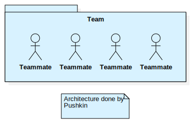
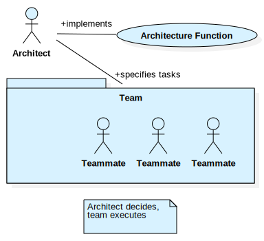
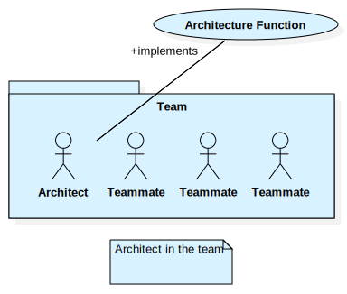
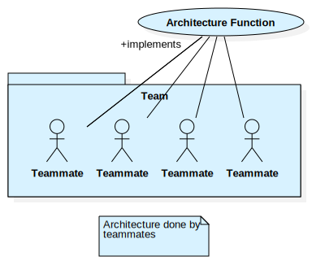

Кто в ответе?
=============

Не всегда архитектор, но функция
--------------------------------
_Остановись на секунду_ и скажи свое мнение –
какие есть варианты распределения работ конкретного типа по организации? Например, как можно в компании распределить работы по тестированию ПО?

_Давай для примера представим_
распределение работ в обычной семье. Часть функций *сконцентрирована на выделенных членах внутри семьи*, например, функция дарения тепла и радости возложена на домашнего питомца. Часть функций *сконцентрирована на выделенных членах вне семьи* – например, функция утреннего выходного выбешивания сконцентрирована на человеке-соседе с перфоратором. А часть функций *размазана* по нескольким участникам внутри и выполняется зачастую *коллективно* – например, выполнение школьных домашек по математике и лепка из желудей. Ну а другая часть функций *размазана* по нескольким участникам и выполняется поочередно.

Точно так же и в корпоративных оргструктурах. Мы попозже обсудим, что такое проектирование и архитектура, но сначала давай обсудим _кто_ может выполнять эту архитектурную работу в компании. Любую работу в оргструктуре можно *сконцентрировать* – возложить на специально ответственного за это человека. Но можно и *«размазать»* – возложить эту работу на группу людей (с чередованием или коллективным вовлечением).

Поэтому корректнее говорить не о конкретном человеке-«архитекторе», а об архитектурной _функции_, – способности и возможности выполнять соответствующую работу. Носителями этой архитектурной функции может быть как и выделенный «архитектор», несколько «архитекторов», так и вся команда как «единый коллективный архитектор».

Так что формально ты можешь не быть архитектором, но при этом участвовать в некоторых обсуждениях, предлагать часть решений, проверять их. То есть *быть носителем архитектурной функции* для своих команд.

_Что это значит конкретно для тебя?_
Ты – носитель архитектурной функции. Чтобы ты эффективнее выполнял эту работу, мы и создали для тебя эти материалы. Они не сделают тебя профессиональным специализированным архитектором. Но дадут достаточное понимание, чтобы ты эффективнее общался с другими носителями архитектурной функции, понимал типовые проблемы и их решения. То есть выступал максимально эффективно при решениях архитектурных вопросов, насколько это возможно для этого сжатого введения.

_Что дальше?_
Как ты думаешь, а в зависимости от того, как распределяется функция, будет ли меняться качество и скорость работы? Как?

Справочник шаблонов распределения архитектурной функции
-------------------------------------------------------
Один из известных в сообществе архитекторов, Gregor Hohpe, описал[@hohpe2020] варианты того, кто отвечает за архитектурную функцию.

| Паттерн                           | Иллюстрация                                                                                            | Описание                                                                                                                                                                                                                                                                                                      |
|-----------------------------------|--------------------------------------------------------------------------------------------------------|---------------------------------------------------------------------------------------------------------------------------------------------------------------------------------------------------------------------------------------------------------------------------------------------------------------|
| "Implicit" architecture           |                    | Архитектурная функция отсутствует. То есть никто не занимается этой работой, система получается, как получается и производство несет сумасшедшие риски.                                                                                                                                                       |
| "Benevolent Dictator"             |              | Архитектурная функция сконцентрирована в одном человеке вне команды. Поток информации и задач односторонний – только от него в сторону команды. Решения принимаются медленно (он неизбежно станет узким местом процесса) и неудачно (его оторванные от реальности решения сложно или невозможно реализовать). |
| "Primus inter pares"              |               | Архитектурная функция сконцентрирована в одном человеке в рамках команды. Общение с остальной командой двустороннее, решения принимаются быстрее и эффективнее.                                                                                                                                               |
| "Architecture without architects" |  | Архитектурная функция «размазана» по команде, она вся – коллективный архитектор. Но это не значит, что все постоянно вовлечены в архитектурные задачи. Вовлечение каждого участника происходит по ситуации и по наличию экспертизы для текущей задачи.                                                        |

_Что это значит конкретно для тебя?_
Современный бизнес ждет от нас, it-производства, быстрых и качественных решений, а так же возможности масштабировать производство. Поэтому мы тяготеем в сторону "Architecture without architects". Это значит, что архитектурная функция сегодня требует коммуникативных и soft skills: умения общаться, договариваться, решать структурные конфликты. Поэтому очень важно, чтобы ты хотел и умел работать с людьми. Сегодня для эффективного решения архитектурных задач не достаточно только hard skills.

_Что дальше?_
Как ты думаешь, а что такое проектирование и архитектура?
