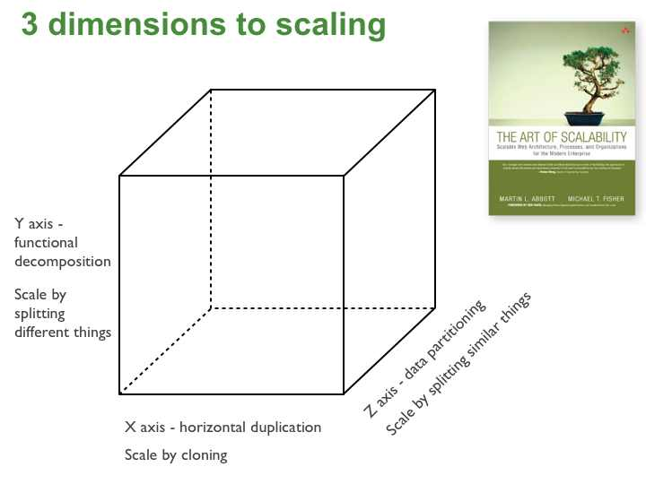
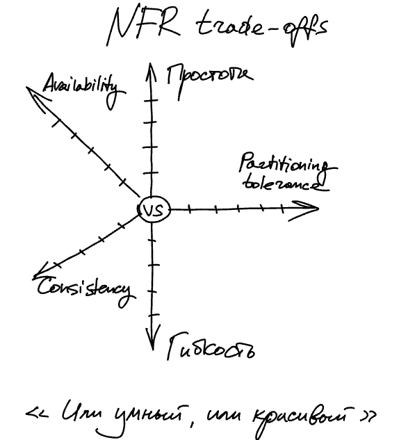
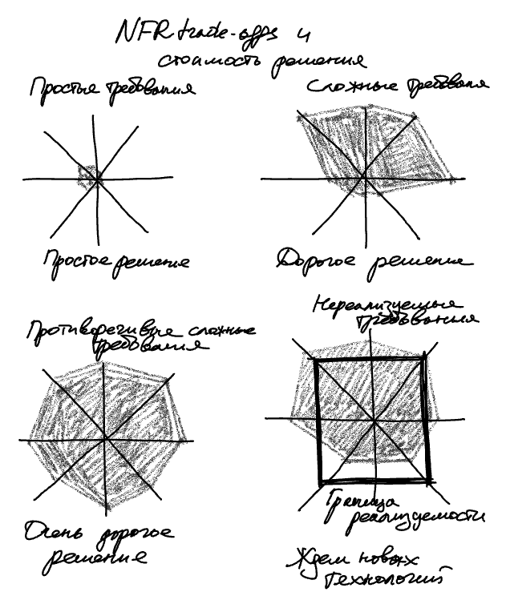

Trade-offs (дилеммы)
====================
Существует ряд связанных фундаментальных инженерных проблем, три основных из которых мы тут обсуждаем. 
Это _Противоречивость требований_, _Неопределенность реализации_, _Неопределенность требований_. Они сильно переплетаются.
Далее рассмотрим первую из них – Противоречивость требований.

Дилеммы в требованиях: FR
---------------------
_Остановись на секунду_ и скажи свое мнение – могут ли требования "мешать" друг другу? То есть их *одновременная реализация затруднена*? 

Действительно, изначально требования к системе могут быть противоречивы.
_Например_, мы проектируем систему для онлайн-ритейла в гипотетическом правовом пространстве:

> Я как пользователь, в соответствии с законом "О защите пользовательских данных", хочу удалить свой аккаунт, чтобы *нигде не сохранилась история* моих покупок и оплат.

> Я как оператор магазина, в соответствии с Налоговым кодексом, по запросу налоговой службы *должен предоставить историю*: выписку покупок и оплат для конкретного пользователя.  

Это пример противоречивых требований к поведению системы – функциональных требований, FR. Противоречивость FR чаще всего решается на уровне анализа: путем доработки требований и предметной области, довыявления и доуточнения требований. Иногда, хоть и редко, такие противоречия можно снять и инженерным решением.

Но если противоречие функциональных требований можно проработать на уровне анализа требований и предметной области, то есть противоречия, которые в основном затрагивают проектирование. И возникают эти противоречия именно из-за возможных инженерных решений. Это противоречия нефункциональных требований/атрибутов качества (NFR/QA). 

Часто NFR оказывают большее влияние на архитектуру, чем FR. То есть разные по функционалу системы могут быть очень похожими в реализации. А вот разные NFR (даже при таких же или схожих FR) приведут к довольно сильно отличающимся архитектурам. Поэтому и противоречия в NFR сильнее влияют на наши инженерные решения. 

_Что это значит конкретно для тебя?_
1. Зачастую первичные требования противоречивы
1. Противоречия функциональных требований снимаются на уровне анализа требований и предметной области
1. Противоречия нефункциональных требований заставят нас искать особенные инженерные решения
1. Тебе, как носителю архитектурной функции, будет необходимо очень плотно работать с аналитиками – чтобы понимать, где можно решить противоречия доуточнением требований, а где придется переосмысливать инженерные решения

_Что дальше?_
Можешь привести примеры не из IT, из реальной жизни, когда характеристики (NFR/QA) системы "мешают" друг другу – сильно усложняется реализация при одновременном пожелании определенных характеристик? 

Дилеммы в требованиях: NFR
---------------------
_Остановись на секунду_ и скажи свое мнение *как пользователь* информационных систем – из твоего опыта, какие характеристики систем разработчикам сложно получается сочетать, реализовать одновременно?

Опыт разработки привел индустрию к пониманию частых противоречий характеристик. Причины этого лежат в ограничениях тех типовых решений, которые мы применяем. И в целом получается, что некоторые требования часто сложно реализовать совместно, что дает некоторую интуицию – что *придется выбирать* (или сильно усложнять, о чем поговорим ниже). Поэтому такой выбор назвали _дилеммой_ (trade-off). Мы готовим себя к тому, что почти всегда нужно будет заплатить одной характеристикой за другую ("торгуемся за" = trade-off).

Ежедневный пример из пользовательского опыта: удобство VS безопасность. Как бы мы ни старались, информационная безопасность системы сильно усложняет жизнь пользователя, бьет по удобству.

Более сложный, но так же хрестоматийный пример из проектирования систем: CAP-теорема[@cap]. Суть в том, что мы не сможем построить систему из нескольких распределенных компонентов, если ждем от системы: 
- (Partitioning tolerance) Работоспособности в разобранном состоянии – ситуации поломок отдельных узлов или сети. То есть хотим ли работоспособности системы по принципу "все или ничего" или ждем, что она будет работать в ситуации, когда некоторые части отвалились. 
- (Availability) Доступности – способности системы отвечать на наши запросы.
- (Consistency) Целостности – отсутствия расхождения в данных по всей системе целиком.
В рамках этой трилеммы придется торговаться – выбирать две характеристики ценой третьей.

Например, при проектировании банковской системы:
1. Можем запроектировать классический "тупой" веб-клиент. Тогда в случае нарушения канала от клиента к серверам, пользователю недоступен никакой функционал. То есть мы пожертвовали характеристикой Partitioning tolerance, и система целиком не работает в этом случае. Зато если канал работает, то пользователь получает функционал быстро и данные согласованы по всей системе.
1. Можем запроектировать "умный" клиент с хранением данных и поведением на стороне пользователя, например, мобильное приложение. Тогда это приложение работоспособно даже в условиях нарушения канала от клиента к серверам (не жертвуем P). И придется выбирать между A и C: или пользователь может совершать операции в мобильном приложении (система Доступна) ценой расхождения данных в системе, Нецелостности этих данных (в мобильном приложении после операции одни данные, а на серверах – другие и после восстановления канала данные синхронизируется, но система в целом долгое время находится в рассогласованном состоянии).
CAP-теорема считается уже слегка устаревшей и со слишком размытыми формулировками, поэтому чаще инженеры оперируют более современными версиями таких trade-offs, например, PACELC theorem[@pacelc]. Тем не менее, для иллюстрации фундаментальных дилемм проектирования CAP вполне подходит и сегодня.

Еще один уже хрестоматийный пример трилеммы в дизайне систем – Scalability Cube (Куб масштабируемости) из книги The Art of Scalability[@scalabilityart]. Это трилемма между Split by Function (тонкой нарезкой функционала по компонентам), Horizontal Duplication (дублированием) и Lookup Splits (тонкой нарезкой данных). Рекомендуем эту книгу на перспективу, когда ты столкнешься с задачами реализовать такую характеристику системы, как Scalability (нагрузочная масштабируемость).

Это примеры дилемм для внешних, наблюдаемых пользователями, характеристик системы. А что по поводу внутренних NFR? Нет ли дилемм в характеристиках, которые разработчики предъявляют к системе? Да, конечно же, такие дилеммы точно так же присутствуют и в этих требованиях.

Самый яркий пример выбора, который архитекторы, проектировщики и разработчики совершают несколько раз в день – это выбор между Простотой и Гибкостью. Под простотой мы тут понимаем не простоту понимания (это лишь часть), а простоту всей реализации – общую трудоемкость. Можно сделать проще (дешевле, быстрее), а можно сложнее (дольше, дороже). Но откуда появляется удорожание? Вряд ли мы сами хотим делать все мучительно долго и дорого? Обычно усложнение приходит с необходимостью сделать гибко/расширяемо. То есть чтобы завтра можно было легко менять систему, сегодня ее нужно реализовать сложнее (то есть дороже). Поэтому появляется простая инженерная интуиция – чем нужно гибче, тем получится сложнее и дороже.

Более формально эта проблема известна в инженерии ПО как Expression Problem (Проблема выразительности средств)[@expressionproblem]. Это трилемма, и звучит она по смыслу примерно так: "Твои выразительные средства – язык программирования, библиотеки, фреймворки, приемы проектирования. Достаточны ли они, чтобы обеспечить **Гибкость**, расширяемость системы: (1) для **нового поведения**, (2) для **новых типов/структур** данных, да еще чтобы (3) **без изменения** существующего кода?" И оказывается, что это очень непростая задача, которая решается или жертвой одного из пожеланий, или существенным усложнением/удорожанием. И если посмотреть через эту призму на приемы проектирования (паттерны, шаблоны), то окажется, если откинуть приемы, обеспечивающие внешние NFR, что большинство приемов – это разные варианты решения Expression Problem. От простых к сложным. (Например, в свое время для автора только понимание Expression Problem открыло, зачем нужен паттерн Visitor[@gof])

_Что это значит конкретно для тебя?_
Получается, что работа при проектировании чаще всего выглядит так: мы перебираем приемы (паттерны), пытаясь одновременно усидеть на нескольких разбегающихся стульях. И чтобы эффективно это делать, тренируйся:
1. В любой задаче видеть дилеммы, которые за ней скрываются. Для этого задавай себе простой вопрос: "для такого варианта дизайна системы, _как поменяются характеристики системы_?" Что улучшаю какой ценой?
1. Когда изучаешь приемы (паттерны), сразу оценивай их с точки зрения того, как этот прием меняет характеристики системы. Какие характеристики улучшаются ценой ухудшения других?
1. Часть паттернов определяет внешние NFR, часть – внутренние NFR. Связывай это.

Минимальный справочник частых дилемм в дизайне
----------------------------------------------
Наиболее часто при проектировании приходится или неприемлемо усложнять, или выбирать между:
- простота/трудоемкость vs гибкость/расширяемость
- безопасность vs удобство 
- безопасность vs производительность
- производительность vs надежность/доступность
- масштабируемость vs целостность данных

Это очень упрощенная картина, но важно, чтобы ты начал каждое свое решение обосновывать через эти решаемые trade-offs. Проектировать, решая даже эти дилеммы, очень непросто, так как все сложившиеся для данной системы trade-offs нужно решить своим дизайном _одновременно_. 

Но в процессе накопления опыта эта личная картинка начнет усложняться, обрастать вариантами и под-вариантами, в итоге образуя сложное запутанное дерево инженерных решений. На готовые профили требований с их конфликтами ты сможешь отвечать готовыми приемами. 

Справочник принципов разрешения дилемм
-------------------------------------
Представь, что ты услышал спор разработчиков. Выясняется, что они предлагают разные варианты проектирования системы и никак не могут прийти к согласию. Кажется, уже начали выбирать оружие для дуэли на подземной парковке офиса. Как помочь ребятам не убиться, да еще чтобы оба приняли аргументацию итогового решения?

План действий:
1. **Вывод на конструктив**: сформулировать варианты решений не в терминах решения, а в терминах характеристик системы. Используй простой вопрос: "как твое решение поменяет характеристики системы?"

1. Далее три варианта принятия итогового решения (от самого эффективного способа к наименее эффективному):

2.1. **Принятие реальности**: выбираем то решение, которое приближает систему к нужному результату, то есть характеристикам, сформулированным в требованиях. То есть делаем то, что нужно от системы по требованиям к ней. Почему такой очевидный вариант не применяется всегда? Одной из причин является внутреннее желание разработчиков сделать не так, как надо, а как "хочется". Чтобы было "красиво", "интересно". Давай обозначим это явление как "самоудовлетворение на фоне инженерного зуда". И осмысленные вопросы не про "как это сделать", а про "зачем мы это делаем" обычно выводят инженеров из транса и они адекватно воспринимают возврат в реальность.

2.2. **Принцип специализации**: вместо одного итогового решения синтезируем два, но специализированных. Иногда бывает так, что trade-off очень сложный, и все-таки надо реализовать противоречащие характеристики одновременно. Тогда мы можем вместо одного универсального решения синтезировать два, которые будут одновременно работать в системе, но давать разные характеристики. Пример из книги Performance Solutions[@perfsol] – прием Fast Lane Reader: например, мы пишем систему с данными в БД и хочется одновременно высокие производительность работы с БД и скорость разработки. Для производительной работы с БД нужно использовать один подход – JDBC API, а для ускорения разработки другой – JPA. И в предыдущем варианте принятия итогового решения мы бы посмотрели в требованиях, что важнее по требованиям и железной рукой выбрали бы соответствующий вариант реализации. А при использовании принципа специализации мы в одной системе реализуем сразу оба подхода – и JDBC, и JPA. И разводим функционал системы по этим двум "полосам движения": функционал, который требует высокопроизводительной работы с БД, ходит в БД с помощью JDBC. А остальной функционал, его большая часть, ходит в БД через JPA. Получается, вместо одного универсального решения мы имеем два специализированных и разводим их по функционалу. Отсюда и название – принцип _специализации_.

2.3. **Компромисс**: из предлагаемых решений Пети и Васи синтезируем такое решение, чтобы использовались оба предложенных варианта и оба участника остались довольны. Самый неудачный для системы вариант – получится плохо с точки зрения желаемых требований, но иногда инженеры принимают так решения, чтобы сохранить отношения в команде. Не будь как Петя и Вася. Лучше принимай реальность или синтезируй специализированные решения в случае сложных trade-offs.

_Что дальше?_
Ок, с типовыми дилеммами требований разобрались. А что по поводу типовых решений? Знаешь ли ты справочники готовых типовых решений в проектировании систем?
