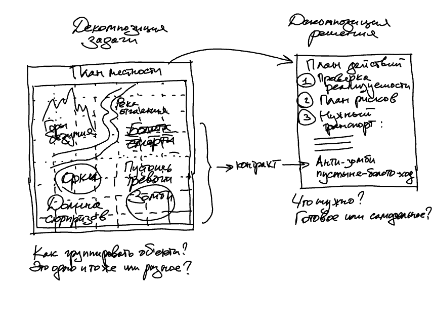
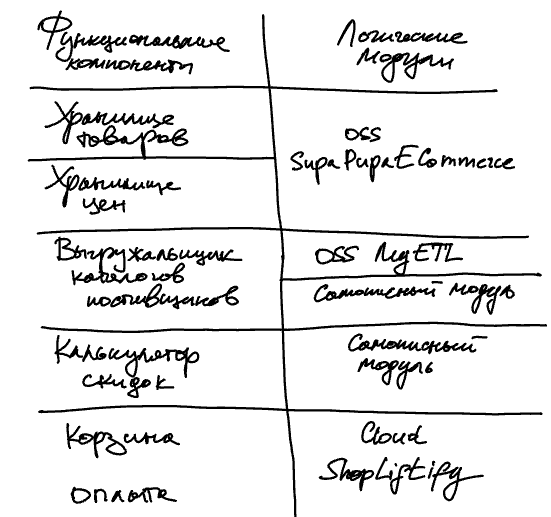
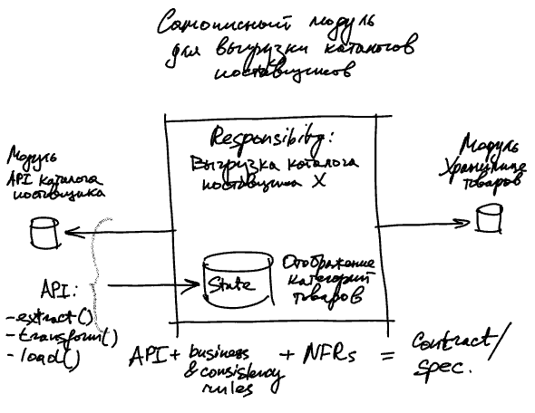
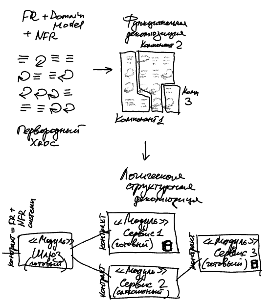
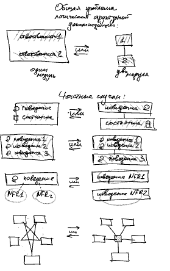
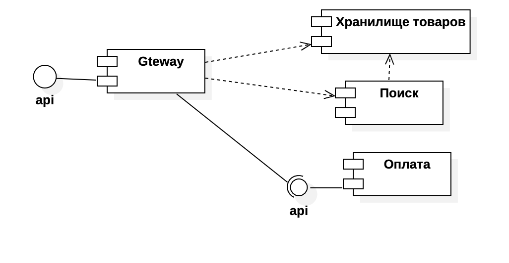
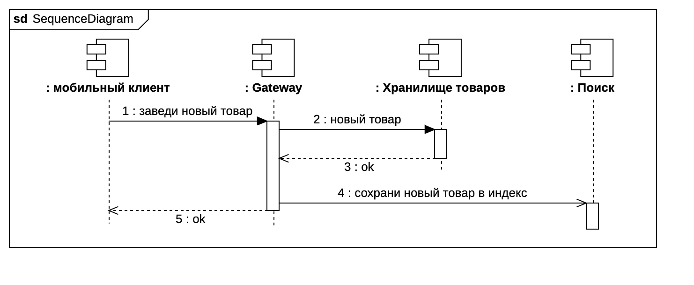
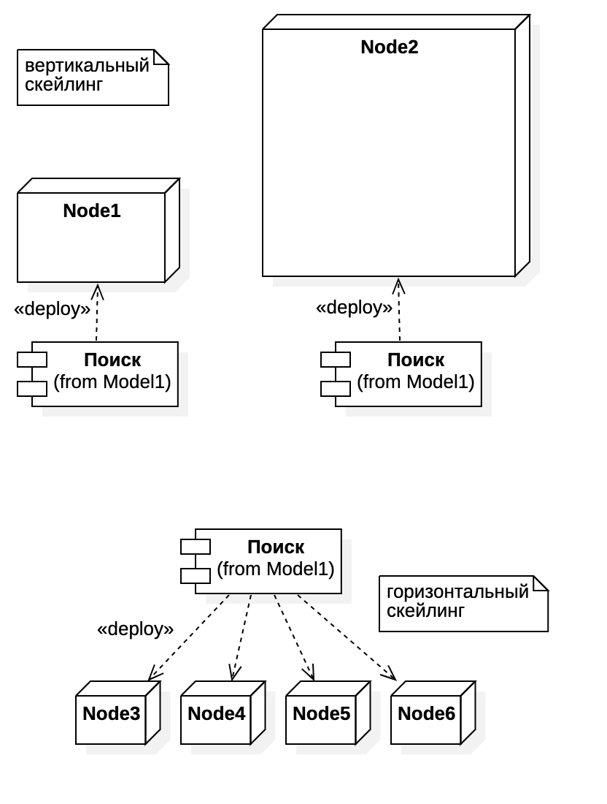
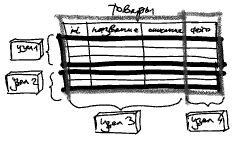
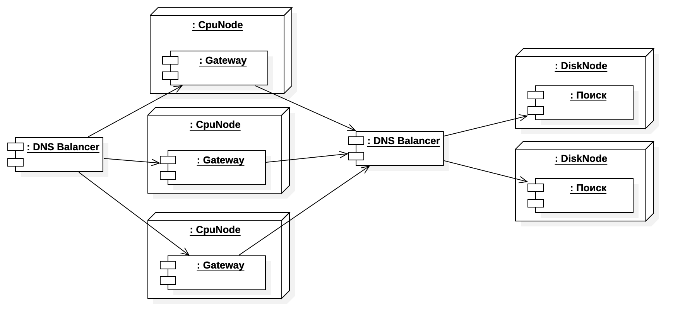

Топчик частых решений в дизайне
===============================
Наиболее частые решения при проектировании, которые приходится принимать. 

Справочник принципов функциональной декомпозиции
------------------------------------------------
Функциональная декомпозиция – это еще не про дизайн системы, но отправная точка для него. Это процесс группировки желаемого _поведения_ (которое определяется FR, функциональными требованиями) в кучки с очерченными границами. Эти кучки поведения – крупные блоки функционала, которые часто обозначаются[@ailevmodcomp] как "компоненты" (в парадигме системоинженерного менеджмента строго не путать с "модулями"). Обычно эти куски функционала удобно называть непосредственно по выполняемой функции.

_Например_, для онлайн-ритейла:

| FR                                                   | логика                                              | Выявленный компонент | NFR                                                    |
|------------------------------------------------------|-----------------------------------------------------|----------------------|--------------------------------------------------------|
| Как пользователь, я хочу просмотреть каталог товаров | значит, в системе должна быть "хранилка товаров"    | Хранилище товаров    | метрики производительности, надежности, etc.           |
| Как пользователь, я хочу найти товар по описанию     | значит, в системе должна быть "искалка"             | Поисковая система    | метрики производительности, объемов, etc.              |
| Как пользователь, я хочу оплатить товар              | значит, в системе должна быть "принималка платежей" | Платежный шлюз       | метрики удобства, производительности, надежности, etc. |

Зачем мы проводим этот процесс функциональной декомпозиции системы – выявление функциональных компонентов? Мы получаем два основных преимущества:
1. Мы можем раньше увидеть риски реализуемости. По сложности функционала сразу понять – где мы уверены в успешной реализации, а где нужны дополнительные вложения и инженерные исследования. И по NFR так же можем оценить риски реализации – где будет легко достичь метрик, а где сложно или нереализуемо.
1. Мы можем относительно легко подобрать под нужный функционал ("компонент") уже существующую готовую реализацию ("модуль"). Причем как с внешнего рынка ПО, включая open source, так и внутри нашего корпоративного it-ландшафта.
1. Даже если не подберем подходящий готовый модуль, нам все равно легче идти дальше: у нас есть почти готовые требования к самостоятельной реализации модуля. Разрабатывать тем проще, чем четче ясны требования к разрабатываемому модулю. Такие требования к отдельному модулю так же часто называют "контракт"[@meyerdbc]. 
1. Функциональная декомпозиция влияет на план работ: какие модули можно реализовать параллельно, а какие жестко зависят друг от друга.

_Пример_ проектирования онлайн-ритейла:
Выделенные в процессе функциональной декомпозиции нужные компоненты: хранилище каталогов, extract-transform-load из системы поставщиков, поисковая система, корзина, платежный шлюз.

И теперь внимание – смертельный номер! Рисуем архитектуру здоровенной системы за 10 секунд! Барабанная дробь! Внимание на итоговый архитектурный документ!!!

```
  -------------------------------
 | SupaPupaECommerce OSS v13.666 |
  -------------------------------
```
Что произошло? Для выявленных компонентов (функций) мы провели исследование и подобрали модуль (готовую реализацию) и проверили соответствие его характеристик нашим задачам. И нам повезло, что сразу все желаемые компоненты закрыл всего лишь один готовый модуль – существующий на рынке продукт SupaPupaECommerce OSS. 

Конечно, в реальности нам не так часто везет и чаще весь выявленный набор компонент мы будем закрывать несколькими модулями. И, безусловно, нет гарантий, что найдем нужный модуль среди готового бесплатного и платного ПО или в реализованных модулях нашего it-ландшафта. Тогда нужно будет реализовать самим необходимый модуль, заниматься его проектированием и разработкой.

Так что мы немного слукавили в примере насчет 10 секунд. Это время только на рисование диаграммы – фиксацию архитектурных решений. А вот на функциональную декомпозицию с компонентами и их NFR, анализ рынка и сравнение готовых модулей, проверку соответствия уйдет гораздо больше сил.

Итак, каковы принципы функциональной декомпозиции? Представь, что ты взял в руки горсть UserStory и бросил на стол. Как теперь эту большую кучу разбить на аккуратные маленькие кучки (декомпозировать), чтобы получить желаемые преимущества (раннюю проверку рисков, подбор готовых модулей, готовые контракты разрабатываемых модулей и параллельность работ)?

Принципы функциональной декомпозиции:

| Принцип кучкования FR в компоненты           | Wat?                                                                                                                                                                                                                                                                                                                                    |
|----------------------------------------------|-----------------------------------------------------------------------------------------------------------------------------------------------------------------------------------------------------------------------------------------------------------------------------------------------------------------------------------------|
| Сцепленность по поведению                    | Различный функционал явно и однозначно зависит друг от друга. Например, путем вызова.                                                                                                                                                                                                                                                   |
| Сцепленность по структурам данных            | Различный функционал использует одни и те же сущности предметной области (domain model).                                                                                                                                                                                                                                                |
| Совместная изменчивость поведения            | Если предполагается, что различный функционал будет одновременно меняться при будущих изменениях требований – повод группировать в один компонент.                                                                                                                                                                                      |
| Совместная изменчивость структур данных      | Если предполагается, что различный функционал использует одни и те же сущности предметной области, которые будут одновременно меняться при будущих изменениях требований – повод группировать в один компонент.                                                                                                                         |
| Различный операционный жизненный цикл данных | Если функционал использует данные с "быстрым" жизненным циклом данных – мы отпилим его в отдельный компонент от функционала с "медленными" данными. Например, компонент "Каталог товаров" отпилим от компонента "Архив цен", а "Хранилище эмитентов" отпилим от "Цены акций эмитентов"                                                  |
| Схожесть или различие в NFR                  | От различного функционала ожидаются характеристики NFR разных порядков. Например, распилим схожие по функционалу компоненты "Хранилище персональных данных" и "Хранилище учетных записей"                                                                                                                                               |
| Оргструктура производства                    | Декомпозируем функционал в соответствии со структурой наших команд разработки. Да, наши решения по системе (данная функциональная декомпозиция, например) зависят от нашей производственной системы (оргструктура, потоки работ и коммуникаций)[@conway]. Тогда производственные риски _такой_ системы и ее стоимость значительно ниже. |

Для быстрого и комфортного проведения функциональной декомпозиции существуют готовые процессные практики, например, Event Storming[@eventstormig] и User Story Mapping[@usmapping]. Хотя там и не используется терминология с "функциональной декомпозицией на компоненты", но по смыслу происходящего это именно оно. Так же ты часто увидишь, что для legacy-систем этот этап или опускается, или проводится неформально ("в уме").

_Что это значит конкретно для тебя?_

1. Перед непосредственным проектированием системы мы сначала смотрим на нее с определенной точки зрения (PoV): на ее функционал.
1. И принимаем решения по тому, как этот функционал нарезать (на "компоненты"). Пока это не про саму систему, а про то, как мы смотрим на требования к ней и как эти требования разбиваем на кучки.
1. Это сильно поможет нам в ранних оценках архитектурных рисков, в поиске готовых "модулей" и описании контрактов для собственных модулей.
1. Функциональную декомпозицию могут проводить как в виде явной групповой активности, так и в неявной форме ("в уме"), так и совсем не проводить (характерно для стабильных, legacy систем)
1. В процессе общения обрати внимание на то, что разные стейкхолдеры привыкли коммуницировать про разные вещи: пользователи, заказчики (и в целом бизнес), enterprise и solution архитекторы – они больше при общении имеют в виду компоненты (функционал), а system архитекторы и разработчики – они чае неявно подразумевают модули (конкретную реализацию).



_Что дальше?_
Как ты думаешь, какой следующий шаг – с такой точки зрения (PoV) стоит начинать рассматривать систему и принимать соответствующие решения?

Справочник принципов структурной декомпозиции
--------------------------------------------
На будущую систему можно смотреть с разных точек зрения (PoV): из чего состоит, какой порядок вызовов, как хранит данные, как развертывается и т.д. Но есть одна точка зрения, где решения наиболее важны на ранних этапах: это то, _из чего_ будет состоять будущая система, ее _структура_.
Приняв решения по структурной декомпозиции, мы определяем то, _как_ эту систему можно производить, какие работы понадобятся, как их можно распараллелить, какие ресурсы понадобятся. То есть структурная декомпозиция значительно определяет _план работ_, _ресурсный план_ и _план рисков_. Поэтому чаще всего осознанно или интуитивно проектирование системы начинается именно со структурной декомпозиции.

В процессе проектирования структуры системы нам нужно принять решения, из чего будет состоять эта будущая система – определить модули: 
- состав модулей (как мы покрываем необходимый функционал системы, ее компоненты)
- контракты модулей (что мы ждем по поведению и характеристикам от каждого модуля)
- какие можно взять готовые модули или нужно пилить самим (исследование рынка и it-ландшафта на соответствие желаемому контракту)
Хорошими вводными данными являются результаты предыдущего шага – функциональной декомпозиции, если она проводилась.



Но вариантов распилить систему на элементы огромное количество. Часть вариантов ограничивается тем, какие готовые модули мы найдем на рынке или внутри компании. Но не всегда получается найти готовые модули или они могут не подходить по характеристикам NFR, или наоборот – слишком много готовых вариантов. Поэтому чаще всего все равно придется решать, как собрать систему из выбранных готовых или самописных модулей. 

Сначала давайте подробнее посмотрим на модуль как составную часть системы. Основные свойства модуля как элемента будущей системы:
1. *Границы*. Мы можем проектировать модули независимо друг от друга. И второе важное следствие наличия границ – на каждом этапе проектирования мы принимаем решения про модуль "извне" его границ – про его отношения с другими, про связи, но не лезем внутрь границ. То есть мыслим абстрактно – крупными блоками, не вдаваясь в то, как они будут реализованы внутри. Безусловно, при любой необходимости или когда придет время реализации модуля, мы задумаемся о его внутреннем устройстве, но стараемся не делать это раньше необходимого времени. Это позволяет проектировать крупные системы быстрее и качественнее (за счет делегирования реализации на разработчика-исполнителя, который лучше знает контекст и как эффективнее реализовать "по месту" и на тот момент, когда будет больше необходимой информации для эффективной реализации).   
1. *Ответственность(и)/Назначение(я)*. Responsibility – высокоуровневое обозначение задач, которые решает этот модуль, зачем он нужен. Например, "Модуль хранения истории заказов". И название модуля чаще всего определяется именно исходя их его ключевых ответственностей. Их можно формулировать по-своему, но чаще всего эти названия уже придуманы в паттернах (шаблонах, приемах) проектирования. То есть паттерны предлагают готовые ответственности и как их раскидать по классам для решения нужной задачи. И у тебя появляются модули с названиями "сервис", "репозиторий", "шлюз", и т.д. Про эти готовые приемы мы поговорим позже. Пока стоит отметить, что формулировка ответственности чаще всего крутиться вокруг данных или поведения.    
- *Данные/Состояние*. Ответственность модуля может сводиться к хранению и минимальной обработке хранимых данных. Значимым вопросом является, сохраняются ли данные надолго (переживут ли данные рестарт системы) – тогда такие данные называют персистентными (Persistent) или данные хранятся в памяти (In-memory). Зачастую это важно решить на ранних этапах, так как это сильно определяет характеристики NFR и отношения с другими модулями. Данные, хранимые модулем, еще часто называют Состоянием (State). И чем более персистентны данные, тем чаще ты услышишь, что этот модуль "с состоянием" (stateful).   
- *Бизнес-логика/Поведение*. Ответственность модуля может сводиться не к хранению данных, а только к обработке входящих запросов. Тогда за хранение данных ответственны другие модули, а наш модуль лишь обращается к ним.
- *Комбинированная* ответственность. Модуль может брать на себя ответственности и по сложной обработке, и по хранению данных.
1. *Контракт/спецификация*. Лишь названием и несколькими ответственностями удобно оперировать, пока вы на этапе высокоуровнего проектирования. Но по мере приближения к реализации, тебе понадобится более подробно описать разработчику, что требуется от модуля. Это описание называют спецификацией или контрактом[@meyerdbc] Туда включается:
- Описание API (Application Programming Interface). Операции и их входные и выходные структуры данных.
- Бизнес-правила и правила целостности данных. Входных, выходных и хранимых.
- Характеристики NFR.
1. Связи модуля с другими модулями. Об этом подробнее поговорим чуть позже в разделе Справочник принципов проектирования взаимодействий. 

И важно, что не обязательно проектировать все аспекты модулей сразу. Сначала необходимо сфокусироваться на тех аспектах, которые важнее всего – определяющих планы работ и рисков. Например, может быть достаточно определиться только с составом модулей, их ответственностями и связями. А остальное (подробные спецификации) можно отложить и делегировать на будущего разработчика этого модуля[@leanswd].   


Получается, на этапе проектирования структурной декомпозиции нам надо все будущее поведение и состояние системы разбить и ограничить по модулям.


Чем же нужно руководствоваться при декомпозиции будущей системы на модули?


Сначала давай решим, что нам дает разделение поведения или состояния на разные модули:
1. *Упрощение понимания*. Декомпозиция – это древнейший способ борьбы со сложностью. Сразу всего не понять, поэтому мы бъем на кучки, те кучки – на подкучки и тд. Тем самым на каждом уровне декомпозиции система понимаема и мы ее контролируем. Мы сегодня реализуем настолько масштабные системы, что без управления сложностью мы бы гарантированно фейлили бы проекты. Посмотрите на братьев по несчастью - механических инженеров: они точно так же оперируют сначала крупными блоками системы, постепенно их декомпозируя.
1. *Повторное использование* (reuse). Выделив ответственность в отдельный модуль, мы теперь можем обращаться к нему из других модулей, не дублируя в них данные и поведение.
1. *Различная реализация*. Логически разделив модул, мы открываем возможность разработчикам по-разному их реализовать. Это касается и внутреннего дизайна, и даже инструментов реализации – языков программирования и библиотек.
1. *Различные NFR*. Это следствие предыдущего пункта - возможная различная реализация даст возможность обеспечить крайне отличающиеся NFR двух модулей. Это касается и производительности, и надежности, и масштабируемости и всех иных прочих NFR.
1. *Параллельная разработка*. Логически раздели два модуля, мы открываем себе возможность вести их проектирование и разработку параллельно. Даже в случае, если они используют друг друга (с помощью приема заглушек мы сможем разрабатывать и даже тестировать свою реализацию, не дожидаясь готовности зависимого модуля). 

Исходя из этой совокупной желаемой ценности, индустрия в свое время вывела принципы структурной декомпозиции[@principles] – как лучше кучковать поведение и состояние в модули:

| Желательно                             | Wut?                                                                                                                                                                                                                                                                                                                                                                                                                                                                                                                                                                                                                                                                                                                                                                                                                                                                                                                                                                                                                                                                                                                                                                                                                                                                                                                                                                                                                                                                                                                                                                                                                                                                                                                                                                                                                                                                                                                                                                                                                                                                                                                                                      | Y?                                                                                                                  |
|----------------------------------------|-----------------------------------------------------------------------------------------------------------------------------------------------------------------------------------------------------------------------------------------------------------------------------------------------------------------------------------------------------------------------------------------------------------------------------------------------------------------------------------------------------------------------------------------------------------------------------------------------------------------------------------------------------------------------------------------------------------------------------------------------------------------------------------------------------------------------------------------------------------------------------------------------------------------------------------------------------------------------------------------------------------------------------------------------------------------------------------------------------------------------------------------------------------------------------------------------------------------------------------------------------------------------------------------------------------------------------------------------------------------------------------------------------------------------------------------------------------------------------------------------------------------------------------------------------------------------------------------------------------------------------------------------------------------------------------------------------------------------------------------------------------------------------------------------------------------------------------------------------------------------------------------------------------------------------------------------------------------------------------------------------------------------------------------------------------------------------------------------------------------------------------------------------------|---------------------------------------------------------------------------------------------------------------------|
| DRY: Don't Repeat Yourself             | Дублирование поведения и данных – вселенское зло. Уникальные данные и поведение должно быть спрятано в единственном модуле и многократно использоваться другими модулями обращением к нему, а не дублированием кода и данных.                                                                                                                                                                                                                                                                                                                                                                                                                                                                                                                                                                                                                                                                                                                                                                                                                                                                                                                                                                                                                                                                                                                                                                                                                                                                                                                                                                                                                                                                                                                                                                                                                                                                                                                                                                                                                                                                                                                             | При внесении изменений дешевле и быстрее: находить нужный модуль, менять, тестировать и выводить в эксплуатацию.    |
| High Cohesion                          | Cohesion – мера внутренней сцепленности (или слепленности, сбитости) модуля: _внутренней_ зависимости элементов, образующих модуль. То есть если поведение и данные внутри модуля жестко зависимы, это высокая слепленность. Так же к слепленности часто относят фактор однородной (похожей) внутренней реализации.                                                                                                                                                                                                                                                                                                                                                                                                                                                                                                                                                                                                                                                                                                                                                                                                                                                                                                                                                                                                                                                                                                                                                                                                                                                                                                                                                                                                                                                                                                                                                                                                                                                                                                                                                                                                                                       | При внесении изменений дешевле и быстрее: понимать нужные изменения, менять, тестировать и выводить в эксплуатацию. |
| Low Coupling                           | Coupling – степень внешних зависимостей модуля: количество и характер связей _между_ модулями, которую можно представить как стоимость их изменения. То есть если много связей и они жесткие, то есть нам дорого будет их менять, то coupling высокий.                                                                                                                                                                                                                                                                                                                                                                                                                                                                                                                                                                                                                                                                                                                                                                                                                                                                                                                                                                                                                                                                                                                                                                                                                                                                                                                                                                                                                                                                                                                                                                                                                                                                                                                                                                                                                                                                                                    | При внесении изменений дешевле и быстрее: менять, изолированно тестировать и выводить в эксплуатацию.               |             
| (S)RP: Single Responsibility Principle | Модуль реализует одну ответственность. Иногда это свойство еще называют сфокусированностью – модуль сфокусирован на одной задаче.                                                                                                                                                                                                                                                                                                                                                                                                                                                                                                                                                                                                                                                                                                                                                                                                                                                                                                                                                                                                                                                                                                                                                                                                                                                                                                                                                                                                                                                                                                                                                                                                                                                                                                                                                                                                                                                                                                                                                                                                                         | При внесении изменений дешевле и быстрее: находить нужный модуль, менять, тестировать и выводить в эксплуатацию.    |
| (O)CP: Open Closed Principle           | Система должна быть закрытой для изменений, но открытой для расширения и повторного использования. С точки зрения метрик процесса разработки изменения – это зло: тратимся на переписывание уже готового, отлаженного, оттестированного модуля. Все затраты несем заново и в процессе еще и ломаем. Поэтому идеальный мир разработки с точки зрения менеджера – "работает - не трогай!" То есть не меняем стабильную реализацию модулей, отливаем их код в граните. Но что делать с изменениями требований, как их вносить? Ответ – новый функционал вносится как новый код. Новые фичи добавляются только как новый код, без изменения существующего. Просто так это не получится – система должна позволять это, то есть быть "открытой для расширения и повторного использования" новым кодом. Как это обеспечить? Нужно изначально заложить в архитектуру точки расширяемости - такие модули и связи, которые мы можем _потом_ дешево менять. Самый простой и известный прием – это отделение от модуля его _интерфейса/API_ в виде отдельного элемента системы наравне с другими модулями и связями. Получается, что модули зависят от интерфейса/API, а модуль, реализующий этот API, нам проще будет заменить на другой c таким же API. Пример из электротехники: мы не связываем все электроприборы с электросетью путем пайки и скрутки. Мы ввели в архитектуру отдельные интерфейсы - сетевые адаптеры (вилки и розетки), которые нам позволяют в дальнейшем легко подключить новую лампу вместо старой. И все это без изменения проводки по всей квартире. То есть наша система закрыта для изменений (проводка буквально в стенах), но открыта для расширения и повторного использования (изменения и добавления новых электроприборов). Всегда ли предусмотренные нами точки расширения (например, отделенные от модулей API) позволят внести в будущем нужные изменения? Нет, к сожалению, будущее изменение требований может такой точки расширения системы, которую мы не предусмотрели изначально (розетка понадобилась там, где мы ее не заложили). В этом случае придется менять систему, нарушая правило ее закрытости для изменений. | При внесении изменений дешевле и быстрее: добавлять новые модули и менять их реализацию, изолированно тестировать.  |
| (L)SP: Liskov Substitution Principle   | Принцип подстановки Ба́рбары Ли́скоу: в рамках расширения системы новым функционалом при замене модуля на другую реализацию необходимо, чтобы новая реализация не нарушала контракт старого модуля. То есть остальные модули системы ждут от нашего модуля сохранения старого контракта (бизнес-правил, правил целостности данных). Казалось бы, нарушить контракт сложно, ведь есть проверяемый интерфейс/API (список операций и типов входных/выходных данных). Но контракт – это больше, чем API: в API не описываются поведенческие аспекты операций, например, операция API `переведиДеньгиСоСчетаНаСчет()` требует зафиксировать, что нельзя перевести больше, чем есть на счете – а это уже контракт. То есть с точки зрения API старая и новая реализации модуля могут быть одинаковы, но новая реализация ведет себя с нарушением договоренностей, данных старой. Все как в жизни: в системе "автомобиль" модуль "топливо" может иметь две очень разных реализации – бензин/дизель, но с одинаковым API. Кстати, для ранней проверки контракта хорошо подходят автотесты, так как они, по сути, как раз проверяют контракт модуля. И хорошие тесты, проходящие для старой реализации модуля, должны падать на новой реализации, если тот нарушает контракт. Значит, вкручивать эту новую реализацию модуля в систему вместо старого – почти наверняка получить баги и аварии.                                                                                                                                                                                                                                                                                                                                                                                                                                                                                                                                                                                                                                                                                                                                                                    | При внесении изменений дешевле и быстрее: заменять модули на их новые реализации.                                   |
| (I)SP: Interface Segregation Principle | Принцип разделения интерфейсов: по сути, это SRP для интерфейсов/API. Проектируйте интерфейсы/API максимально компактными, сфокусированными на одной ответственности. Тогда у тебя будет гораздо больше свободы в проектировании модулей - запроектировать модуль, реализующий несколько сфокусированных интерфейсов, проще по сравнению с ситуацией, когда интерфейсы "жирные". Конструктор API c мелкими деталями – легко собрать нужный функционал.                                                                                                                                                                                                                                                                                                                                                                                                                                                                                                                                                                                                                                                                                                                                                                                                                                                                                                                                                                                                                                                                                                                                                                                                                                                                                                                                                                                                                                                                                                                                                                                                                                                                                                    | При внесении изменений дешевле и быстрее: менять модули, добавлять новые модули, изолированно тестировать.          |
| (D)IP: Dependency Inversion Principle  | Принцип инверсии зависимостей. На самом деле мы его уже встречали при описании OCP. DIP - это есть самый простой и популярный способ заложить в систему точку гибкости, расширяемости. Прием состоит в том, что вместо прямой зависимости двух модулей мы между ними втыкаем интерфейс/API. То есть была одна прямая зависимость, а стало две (оба модуля теперь зависят от интерфейса), причем одна из них – развернутая относительно старой, смотрит от второго модуля на интерфейс, и называется "реализация". На примере электропроводки: мы можем впаять лампочку прямо в проводку, но вместо этого разрезаем эту связь интерфейсом розетки. Получается, система (проводка) зависит от розетки, и лампочка теперь зависит от розетки (реализует интерфейс/API). Вот эта вторая "повернутая" зависимость и дает название принципу – dependency _inversion_.                                                                                                                                                                                                                                                                                                                                                                                                                                                                                                                                                                                                                                                                                                                                                                                                                                                                                                                                                                                                                                                                                                                                                                                                                                                                                           | При внесении изменений дешевле и быстрее: менять модули, добавлять новые модули, изолированно тестировать.          |

Но ничего не дается бесплатно – за полученную ценность необходимо заплатить. И это очень важный trade-off – за полученную гибкость (снижение стоимости изменения и расширения системы) мы расплатимся ее усложнением (трудоемкостью).
Поэтому опытный архитектор не следует слепо этим принципам, а взвешивает каждое решение – стоит ли следование принципу полученного усложнения?
Рекомендуем тебе начинать с принципов - это хорошая отправная точка, но так же начинать тренироваться оценивать свои решения. И помни - потом можно будет поменять и усложнить. 


Посмотри на эту модель и скажи, на какие trade-offs пошел архитектор? Какими характеристиками он пожертвовал ради каких? Какие точки гибкости заложены?

_Что это значит конкретно для тебя?_

1. Принципы проектирования логической структурной декомпозиции стоит знать, чтобы понимать, как мыслят коллеги.
1. Следование этим принципам ты увидишь дальше в шаблонах (приемах) проектирования. Шаблоны как решения конкретных задач, тем не менее, будут побуждать следованию этим принципам.
1. Но ничего не дается бесплатно – за полученную ценность необходимо заплатить. И это очень важный trade-off – за полученную гибкость (снижение стоимости изменения и расширения системы) мы расплатимся ее усложнением (трудоемкостью). Поэтому опытный архитектор не следует слепо этим принципам, а взвешивает каждое решение – стоит ли следование принципу полученного усложнения? Рекомендуем тебе начинать с принципов - это хорошая отправная точка, но так же начинать тренироваться оценивать свои решения. И помни - потом (за отдельную плату) можно будет поменять и усложнить.
1. Логическая структура определяет свойства NFR системы – где инкапсулируются какие данные и поведения (следовательно, что нужно подкрутить для нового поведения), точки расширения системы – api/интерфейсы (где можно дешево менять реализацию модуля на другую).

Справочник вариантов проектирования взаимодействий
--------------------------------------------------
Логическая структурная декомпозиция – это было про статику. Но динамику, взаимодействия мы на той модели не увидим. А наши решения по тому, _как взаимодействуют_ модули, тоже могут быть важны и значительно определять характеристики системы.

Поэтому зачастую нам необходимо подумать и про _логическое проектирование взаимодействий (динамики/алгоритмов)_. Давай посмотрим, какие есть варианты решений по взаимодействию двух модулей - _как_ можно запроектировать взаимодействия:

| Варианты взаимодействия между модулями   | Wut?                                                                                                                                                                                                                                                                                                                                                                                                                                                                                                                                                                                                                                                                                                                                                                                                                                                                                                                                                                                                                                                                                                                                                                                                                           | Y?                                                                                                                                                                                                                                                                                                                                                                                                                                                                        |
|------------------------------------------|--------------------------------------------------------------------------------------------------------------------------------------------------------------------------------------------------------------------------------------------------------------------------------------------------------------------------------------------------------------------------------------------------------------------------------------------------------------------------------------------------------------------------------------------------------------------------------------------------------------------------------------------------------------------------------------------------------------------------------------------------------------------------------------------------------------------------------------------------------------------------------------------------------------------------------------------------------------------------------------------------------------------------------------------------------------------------------------------------------------------------------------------------------------------------------------------------------------------------------|---------------------------------------------------------------------------------------------------------------------------------------------------------------------------------------------------------------------------------------------------------------------------------------------------------------------------------------------------------------------------------------------------------------------------------------------------------------------------|
| rpc VS doc/message                       | RPC (Remote Procedure Call): прием проектирования интерфейса/API модуля, при котором четко описываются возможные операции – с названием операции, входными и выходными данными. В название каждой операции стараются вложить семантику – смысл этой операции. А Document/Message API – иной интерфейс, при котором у модуля нет нескольких операций с разным смыслом, а есть возможность просто принять входные данные (в этом случае эта структура данных называется очень обще – Document или Message). То есть у модуля есть как бы одна операция с очень абстрактным смыслом, что-то типа `обработать`, поэтому часто в Document/Message API даже не заморачиваются подбором названия для этой единственной операции. И как именно отработает эта операция, модуль решает внутри себя и извне – со стороны API этого наверняка сказать нельзя.                                                                                                                                                                                                                                                                                                                                                                             | RPC очень понятен и предсказуем, но изменение описаний операций и расширение API новыми операциями дается дорого (т.к. куча других модулей уже зависит от них). Doc/Message API гораздо более гибкий (стоимость изменения API околонулевая), но ниже понимаемость (выше стоимость локализации - куда вносить какие изменения) и ряд ошибок выявится только при тестировании и эксплуатации, а не на этапе проектирования и разработки.                                    |
| coarse-grained VS fine-grained           | Coarse-grained (крупно-гранулярный API) – это когда у модуля относительно мало "жирных" операций, а fine-grained (мелко-гранулярный API) – когда у модуля относительно много "мелких" операций. То есть если мы что-то хотим от модуля, нам у него надо вызвать одну-две операции или с десяток.                                                                                                                                                                                                                                                                                                                                                                                                                                                                                                                                                                                                                                                                                                                                                                                                                                                                                                                               | Крупно-гранулярные API удобнее для клиентов и проще реализовать NFR (например целостность данных за счет operation-scoped транзакций). Но бывают такие предметные области, что ответственности разделяются между модулями равномерно и вызывающему модулю так же нужно что-то сохранять или вычислять при обращении к целевому модулю. И в этом случае мы вынуждены разбивать операцию на несколько, чтобы дать вызывающей стороне более тонкий контроль.                 |    
| payload: object value VS object id       | Выбор при проектировании API по поводу того, как передавать в операцию сложный объект как входной параметр: целиком объект со всеми данными (by value) или только идентификатор объекта в отдельном хранилище этих объектов (by reference).                                                                                                                                                                                                                                                                                                                                                                                                                                                                                                                                                                                                                                                                                                                                                                                                                                                                                                                                                                                    | Передача данных by value проще в реализации, страдают нагрузочные характеристики, т.к. мы гоняем много данных. Передача by reference может привести к повышенной нагрузке на модуль-хранилище объектов плюс необходимы будут усложнения для обеспечения целостности и актуальности данных в системе при массовом параллельном обсуживании.                                                                                                                                |
| sync VS async                            | Синхронный или блокирующий вызов операции (sync) – привычный нам вызов, когда вызывающий модуль блокируется на время отработки операции вызываемого модуля. Когда ты нажимаешь кнопку в интерфейсе и она сначала немного тормозит, потом выдает ответ – и ты чувствуешь эту задержку на время обработки запроса. А вот асинхронный или неблокирующий вызов (async) – это такой API, при вызове операции которого вызывающая сторона не блокируется. И получается, что и вызывающий модуль продолжает что-то делать, и одновременно с этим вызываемый модуль выполняет запрошенную операцию. На примере интерфейсов такие вызовы выглядят так: ты нажимаешь кнопку и почти мгновенно получаешь ответ. Но это ответ не с желаемым результатом, а с сообщением, что сигнал/запрос/вызов принят. Ты спокойно продолжаешь работать в интерфейсе и через некоторое время выполнения запрошенной операции ты узнаешь ее результат. Внезапно (асинхронно). Чтобы получить этот результат, модуль на твоей стороне обычно или незаметно опрашивает вызываемый модуль: "ну как, готово?" (это опрос, polling), или вызываемый модуль сам известит твой вызывающий модуль, что все готово и вот результат (это обратный вызов, callback). | Синхронные блокирующие вызовы очень понятные и простые в реализации. Но неясно, как реализовать очень долгие операции плюс система хуже масштбируется. Асинхронные API могут быть гораздо дороже в реализации (нужны сложные реализации polling или callback, многопоточности или очередей сообщений, обеспечения целостности данных, обработки ошибок), но долгие операции как раз только так и реализуются плюс такие системы гораздо лучше масштабируются.             |
| p2p direct call VS publisher/subscribers | Вариант прямых вызовов модулями друг друга, где все понятно и однозначно на логической схеме. Или вариант "подписки" – когда наш модуль посылает запрос в специальный модуль-брокер и дальше нам непонятно, кто и как обрабатывает наш запрос. На брокер подписываются другие модули-обработчики, но какие они и сколько их, мы со стороны отправителя не знаем. Получается, что как обрабатывается нащ запрос и кто его обрабатывает – очень легко меняется, вплоть до того, что это может менять прямо в процессе работы системы, без остановки.                                                                                                                                                                                                                                                                                                                                                                                                                                                                                                                                                                                                                                                                             | Очевидность и однозначность p2p прямых вызовов модулей на всех этапах: проектирования, разработки, тестирования, эксплуатации дает низкую стоимость реализации такого API. Но модификация и расширение такой системы будут дороже. А вот вариант API с подпиской сразу закоадывает очень высокую гибкость – очень легко менять поведение системы и расширять его. Правда, за это придется заплатить на ранних этапах - трудоемкостью, внимательностью, документированием. |

Таким образом, часто проектирование взаимодействия между модулями сводится к выбору вариантов из списка выше. Например, мы можем обоснованно запроектировать такой API модуля: `direct coarse-grained sync RPC c передачей параметров по id`. Если ты обоснуешь эти принятые решения через дилеммы в таблице, наши поздравления свежеиспеченному архитектору!  


Посмотри на эту модель и скажи, на какие trade-offs пошел архитектор? Какими NFR он пожертвовал ради каких?

Но это еще не все. Еще рано праздновать и нужно принять еще решения по протоколам (следующий тезис) и физической реализации (следующий раздел). 

Если API тонко-гранулированный, может появиться еще и необходимость запроектировать протокол логического уровня (или _логический протокол_). Дело в том, что API - это просто список операций и явно не дотягивает по понятия 'контракт'. И в случае тонко-гранулированного API возникает необходимость описать _правильную_ последовательность вызовов нескольких операций. Получается API как статика (какие операции можно вызвать?) и протокол как динамика (в каком порядке вызывать операции API?).

Например, давай запроектируем операцию ритуального сепукку архитектора, который не смог избежать позора после совершённой ошибки в архитектуре, которая привела к ухудшению характеристик NFR на проде.

Крупно-гранулированный API операций:
```
совершиСепукку()
```
Протокол:
```
1. совершиСепукку()
```
Протокол предельно простой, думать не надо, описывать нечего.

Тонко-гранулированный API операций:
```
публичнаяРечьСПокаянием()
вскрытиеБрюшнойПолости()
выборОрудия(катана|тата|танто|кусунгобу|вакидзаси)
выборКимоно(юката|хантэн)
```
Протокол с порядком операций и ограничениями на значения данных:
```
1. выборКимоно(any)
2. выборОрудия(кусунгобу)
3. публичнаяРечьСПокаянием()
4. вскрытиеБрюшнойПолости()
```
Ну что же, пожелаем ему дальнейших успехов и отметим, что это _логический_ протокол операции, отражающий смысл предметной области. А попозже у нас появится еще _физический_ (или _транспортный_) протокол – выбор и использование готовых промышленных технологий, реализующих наши вызовы.  

_Что это значит конкретно для тебя?_

1. Обычно после проектирования логической структуры можно заняться проектированием взаимодействий между модулями.
1. Не обязательно проектировать все сразу, важно сфокусироваться на самых значимых взаимодействиях – которые наиболее сильно определяют FR и NFR системы.
1. Для этого определяются контракты модулей и протоколы их взаимодействия.
1. Это позволит для значимых (архитектурных) решений рано проверить их реализуемость по FR и NFR.

Справочник принципов физической декомпозиции
--------------------------------------------
Если необходимо, после проектирования логической структуры и взаимодействий, можно проектировать _физическую_ структуру. Это то, как система декомпозируется (из чего она состоит) на физическом уровне.

Разница между логическим и физическим уровнем проектирования в том, что:
- решения касаются поведения системы в разное время: логический уровень - этап проектирования и разработки, физический уровень – этап отладки, тестирования, развертывания и непосредственно эксплуатации.
- решения принимаются на разном уровне абстракции: на логическом уровне мы не особо учитываем среду выполнения, а на физическом уровне как раз начинаем учитывать среду исполнения.
- в основном решения на физическом уровне касаются распределения модулей по физическим узлам в сети.

Перед тем, как обсудить, какие решения принимаются на физическом уровне, надо отметить неприятные вещи про общепринятую терминологию. Во-первых, её нет. В каждом стандарте или авторской книге термины могут расходиться. И, во-вторых, крайне похожие решения про поведение и данные будут называться сильно по-разному. Это legacy, так сложилось.  

Какие частые решения принимаются на физическом уровне:

| про поведение:                                                                                                                                                                                                                                                                                                                                                                                                                                                                                                                                                         | про данные:                                                                                                                                                                                                                                                                                                                                                                                                                                                                                                                                                                                                                                                                                                                                                                                                                          |
|------------------------------------------------------------------------------------------------------------------------------------------------------------------------------------------------------------------------------------------------------------------------------------------------------------------------------------------------------------------------------------------------------------------------------------------------------------------------------------------------------------------------------------------------------------------------|--------------------------------------------------------------------------------------------------------------------------------------------------------------------------------------------------------------------------------------------------------------------------------------------------------------------------------------------------------------------------------------------------------------------------------------------------------------------------------------------------------------------------------------------------------------------------------------------------------------------------------------------------------------------------------------------------------------------------------------------------------------------------------------------------------------------------------------|
| *Выбор готовых реализаций протоколов связи между модулями: физические/транспортные протоколы*. json + REST over HTTP, xml + REST over HTTP, SOAP over HTTP, gRPC, Protobuf, Thrift, etc.                                                                                                                                                                                                                                                                                                                                                                               | *Выбор готовых технологий и продуктов хранения и доступа к данным*. SQL db, noSQL db, S3 object store, etc.                                                                                                                                                                                                                                                                                                                                                                                                                                                                                                                                                                                                                                                                                                                          |
| *Обеспечение масштабируемости: вертикальное и горизонтальное*. Чтобы выдержать увеличившуюся нагрузку, мы добавим необходимых ресурсов (CPU, RAM, SSD) на существующий сетевой хост – это _вертикальный скейлинг_. А если мы добавим новых хостов – это _горизонтальный скейлинг_. Вертикальный проще, зачастую не требует изменения архитектуры системы, но ограничен. А горизонтальный – сложнее и дороже, чаще требует изменения архитектуры, но позволит масштабировать в гораздо более широких пределах.  | *Вертикальный и горизонтальный шардинг*. Если данных очень много, а нам нужно обеспечить приемлемые характеристики производительности системы, то можно данные разбить на кучки и распределить эти кучки по хостам, чтобы каждый сервер обслуживал свою кучку. Вопрос в том, как разделять (шардировать): если мы хранимые объекты целиком раскидываем по узлам и придумываем классный равномерный алгоритм такого распределения – это _горизонтальный_ шардинг. А если мы разбиваем объекты и часть полей храним на одном узле (например, все текстовые поля товара) и одним способом (например, РСУБД), а другую часть полей (например, фото товара) - на другом хосте и с другим способом хранения (например, объектное хранилище S3), то это _вертикальный_ шардинг.  |
| *Обеспечение отказоустойчивости: горизонтальное масштабирование*.  См. выше – вместо одного хоста закладываем множество, на которых будут выполняться экземпляры одного модуля.                                                                                                                                                                                                                                                                                                                                                                                        | *Репликация/дублирование данных на узлах в сети*. Храним данные _с избыточностью_ – они обязательно должны дублироваться минимум на двух разных серверах (если на нескольких, то это определяется _коэффициентом избыточности_). Может реализовываться средствами самой системы, тогда нам нужно будет продумать архитектуру самим, или избыточность может быть реализована за нас теми инструментами, которые мы выбрали для хранения данных – хранилища РСУБД и noSQL, файловые системы, дисковые массивы.                                                                                                                                                                                                                                                                                                                         |


Посмотри на эту модель и скажи, на какие trade-offs пошел архитектор? Какими NFR он пожертвовал ради каких?

_Что это значит конкретно для тебя?_

1. Обычно после проектирования взаимодействий между модулями можно заняться проектированием того, как раскидать поведение и данные системы по физическим хостам в сети.
1. Не обязательно проектировать все сразу, важно сфокусироваться на самых значимых вопросах – которые наиболее сильно определяют FR и NFR системы.
1. Частенько логический и физические уровни объединяются на одной диаграмме – например, логическая структурная декомпозиция и на ней уже размечены физические протоколы взаимодействия модулей. В этом нет ничего страшного, но стоит отслеживать, чтобы настолько рано принимались действительно значимые решения, которые влияют на архитектуру.
