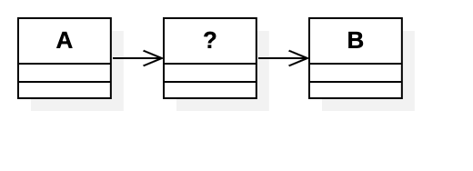
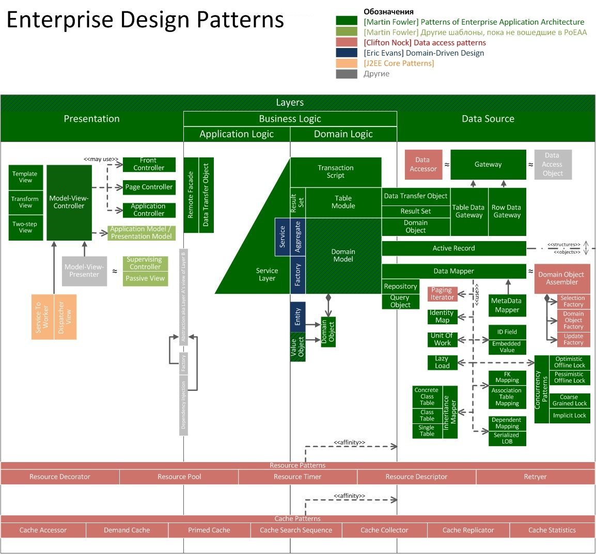

Топчик частых шаблонов проектирования
=====================================
Шаблоны проектирования (паттерн) – это частые типовые приемы, которые применяются при проектировании.

Откуда они берутся? Обычно шаблоны описываются автором или группой авторов в виде книги – _каталога_ шаблонов. Таких каталогов выпущено уже довольно много, поэтому часто наблюдается проблема именования – близкая идея в разных каталогах называется и описывается немного по-разному или наоборот – близкие называния в разных каталогах обозначают сильно отличающиеся приемы. Поэтому при обсуждении решений в случае непонимания всегда стоит возвращаться к сути приема.

Если усреднить по разным каталогам то, как описывается шаблон, обычно проявляется такая структура:

| Часть описания приема | Смысл                                                                                                                                                                                                                                                                                                                                                                                                                                                                                                                                                                                                        |
|-----------------------|--------------------------------------------------------------------------------------------------------------------------------------------------------------------------------------------------------------------------------------------------------------------------------------------------------------------------------------------------------------------------------------------------------------------------------------------------------------------------------------------------------------------------------------------------------------------------------------------------------------|
| Название              | Важная часть описания шаблона – этим именем ты будешь обозначать прием при обдумывании и общении. Если команда разделяет знание об одних и тех же каталогах, то общение становится очень быстрым и эффективным – не нужно подробно описывать свою идею, достаточно просто оперировать именем паттерна. Например, для этого все в команде должны знать, что такое _Фабрика_.                                                                                                                                                                                                                                  |
| Проблема              | Все шаблоны отталкиваются от решаемой проблемы. Это, кстати, сильно отличает шаблон проектирования от принципа проектирования: принцип задает желаемый дизайн (например, "в итоге дизайн должен быть слабосвязанным"), а паттерн предлагает решение конкретной задачи (например, порождающая проблема – "кто должен отвечать за создание объектов") и в итоге тоже приводит дизайн к соответствию принципам.                                                                                                                                                                                                 |
| Примеры, use cases    | Примеры из реальных задач разработки, где возникает эта проблема.                                                                                                                                                                                                                                                                                                                                                                                                                                                                                                                                            |
| Решение               | Решение проблемы чаще всего сводится к появлению новых ответственностей (responsibility) и _распределению этих ответственностей по существующим или новым модулям_. Иногда в описании шаблона эти ответственности еще называются ролями. Например, шаблон "Фабрика" [DDD] для решения порождающей проблемы: _Для порождения объектов введите новый класс, который инкапсулирует создание объектов_. Тут и проблема (как порождать объекты?), и новая ответственность (создание объектов), и рекомендация, на кого возложить эту ответственность (на новый специальный класс).                                | 
| Иллюстрация           | Чаще всего UML-диаграмма, иллюстрирующая реализацию шаблона. Тут сокрыта опасность – многие разработчики смотрят _только_ сюда. Но суть решения в другом – как распределить ответственности (роли) по элементам системы – это текстовое описание, оно важнее. Например, такая иллюстрация: . Что это за паттерн из каталога [GoF]? Дело в том, что в зависимости от ответственности (роли) промежуточного класса это может быть или Adapter, или Decorator, или Proxy. Ответственность (роль) определяет паттерн, а не иллюстрация. |
| Следствия             | Обычно авторы тут описывают особенности, ограничения, побочные эффекты влияния на общий дизайн и trade-offs. И это очень важный раздел. Со временем для тебя станет очень важным то, какие характеристики системы ты размениваешь и это будет определять выбранный тобой прием при проектировании.                                                                                                                                                                                                                                                                                                           |

_Что это значит конкретно для тебя?_

1. Нужно прочитать и понять те каталоги шаблонов, которые используются в команде.
1. При проектировании и обсуждении дизайна в команде оперируй паттернами – тогда мышление и обсуждение будут быстрее и качественнее.
1. Со временем отрасти в голове индекс для быстрого поиска: "проблема" – "типовые решения" из всех знакомых каталогов.
1. Для выбора из возможных типовых решений четко понимай trade-offs каждого варианта: при применении приема как меняются характеристики системы, чем за что ты платишь.
1. Обычно идет расплата сложностью за гибкость. Но не только. 

_Что дальше?_
Мы рассмотрим 5 самых актуальных каталога:

| Каталог              | Область применения шаблонов                                                              |
|----------------------|------------------------------------------------------------------------------------------|
| GoF                  | Проектирование системы (системный дизайн), микро-уровень (уровень отдельных компонентов) |
| PoEAA                | Системный дизайн, уровень архитектуры и микро-уровень                                    |
| Integration Patterns | Дизайн решения, уровень архитектуры и микро-уровень                                      |
| DDD                  | Дизайн системы и решения, уровень архитектуры и микро-уровень                            |
| Microservices        | Дизайн решения и корпоративной архитектуры, уровень архитектуры                          |

GoF [@gof]
---
Это исторически самый первый каталог типовых приемов в программной разработке. Написан коллективом авторов, отсюда и название – книга _Банды Четырех_ (Gang of Four).
Уровень шаблонов – системный микро-дизайн, то есть масштаб классов и их связей. Но другие авторы взяли множество приемов отсюда и перенесли на уровень архитектуры системы и связей между системами, поэтому не удивляйся, что очень похожие по сути решения ты увидишь в других каталогах под другими именами.     

Краткий конспект "23 Patterns in 80 Minutes" от Джошуа Блоха[@blochgof].

PoEAA [@poeaa]
-----
Один из самых известных и часто используемых каталогов. Уровень шаблонов – системный микро-дизайн и системная архитектура. То есть это приемы проектирования отдельной системы с фокусом на типовые корпоративные приложения.
Интересная особенность этого каталога в том, что паттерны из него часто используются разработчиками библиотек и фреймворков – то есть используя популярные библиотеки, ты часто увидишь названия классов прямо из этой книги.

Для упрощения понимания и навигации по этому каталогу лови визуальный гайд-индекс, отражающий структуру системы: .
И краткую шпаргалку – [конспект книги с выжимкой по приемам](https://martinfowler.com/eaaCatalog/) от самого автора.

Integration Patterns [@integrationpatterns]
--------------------
Так же один из самых известных и часто используемых каталогов. Уровень шаблонов – проектирование решения. То есть это уже не столько приемы проектирования отдельной системы, сколько связки систем в решение.
Интересная особенность этого каталога в том, что паттерны из него часто используются разработчиками интеграционных библиотек и фреймворков – то есть используя популярные библиотеки для интеграции систем, ты часто увидишь названия классов прямо из этой книги.

Для упрощения понимания и навигации по этому каталогу лови визуальный [гайд-индекс](https://www.enterpriseintegrationpatterns.com/patterns/messaging/).
А для упрощения применения на практике и чтобы не наступать на грабли – обязательно проработай [корпоративный cookbook](TODO ССЫЛКА НА КОРП COOKBOOK).

DDD [@ddd]
---
С ростом опыта разработки корпоративных систем индустрия пришла к выводу, что значительная часть сложности лежит не в инженерной плоскости – мы кое-как научились строить корпоративные системы. А больше рисков несет в себе сложность предметной области (домен). Домены, которые мы автоматизируем, мало того, что сложные сами по себе, так они еще и каждый раз сильно отличаются.
И однажды Эрик Эванс попробовал сформулировать эти проблемы и предложить решения. Получившаяся книга Domain Driven Design – это каталог паттернов проектирования корпоративных систем с упором на борьбу со сложностью именно предметной области.
Значительная часть приемов, которые касаются инженерной части, унаследованы из PoEAA. Но сверху надстроена целостная система приемов борьбы с рисками домена, которые охватывают проблемы проектирования, коммуникаций, коллективного владения системой.
Особую популярность этому каталогу придает то, что приемы работы с предметной областью очень хорошо потом ложатся на микросервисную архитектуру, поэтому сегодня мы практически всегда мыслим связкой "микросервисная архитектура + приемы работы с предметкой из DDD".

Для упрощения использования лови краткую шпаргалку – [конспект книги с выжимкой по приемам](https://www.infoq.com/minibooks/domain-driven-design-quickly/).

Microservices Patterns [@microservices]
----------------------
Со временем разработчики корпоративных решений и владельцы it-ландшафтов столкнулись еще с одной трудностью, которая возникла при росте объемов и сложности систем: стоимость изменений и их вывода в эксплуатацию.
И оказалось, что классические корпоративные системы тяжело даются изменениям и еще хуже быстро выводить в эксплуатацию даже небольшие изменения. А бизнес начал ждать от it как раз скорости внесения изменений – снижения TTM (time to market, время вывода изменения в эксплуатацию). 

Поэтому очевидным ответом стала декомпозиция больших единых систем ("монолитов") на микро-сервисы. Это позволяет даже для очень небольших изменений быстрее понимать, куда вносить изменения, осуществлять эти изменения, тестировать их, выводить на производственный стенд.

Но за снижение TTM мы расплатились повышением сложности межсервисных связей и самое главное – распределенностью наших систем.
А это тянет за собой необходимость решать сложные задачи, которых просто не было в монолитных приложениях. В распределенной микросервисной среде гораздо дороже обеспечить производительность и целостностью данных. Зато все хорошо с отказоустойчивостью и масштабируемостью.
Поэтому при проектировании микросервисов будь очень внимателен к trade-offs и к тому, как обеспечивается коллективное владение системы командами разработки. 

Для упрощения понимания и навигации по этому каталогу лови визуальный [гайд-индекс](https://microservices.io/patterns/index.html).
А для упрощения применения на практике и чтобы не наступать на грабли – обязательно проработай [корпоративный cookbook](TODO ССЫЛКА НА КОРП COOKBOOK).
