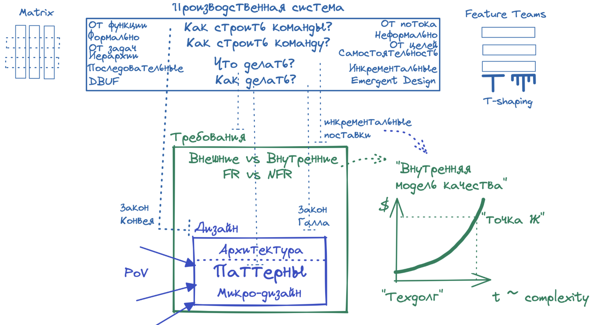

Производство системы производства
=================================
Мы узнали, что производственная система включает в себя выбранные практики борьбы с неопределенностью. И они сильно влияют на архитектурные решения.
Но кроме этого, производственная система – это решения еще и про:
- оргструктуру
- потоки работ
- потоки информации
- потоки ресурсов

И эти решения так же оказывают влияние на архитектуру системы. Тебе, как носителю архитектурной функции, нужно будет учитывать выбранные практики. 

Практики оргдизайна
-------------------
К производственной системе мы так же относим практики _структурирования организационных единиц_ – команд, отделов, департаментов и т.д. Поэтому такие решения называются организационный дизайн.

Какие практики оргдизайна влияют на архитектуру:
- Шаблоны коллективного владения системой: как ответственности и экспертиза разбиты по орг. единицам 
- T-shaping: как ответственности и экспертиза разбиты по участникам внутри команды

Начнем с практик *коллективного владения системой*.
Основные источники про процессные паттерны – книга о DDD[@ddd] в разделе про сохранение целостности при коллективном владении (Preserving Model Integrity) и книга целиком про шаблоны оргдизайна команд Team Topologies[@teamtopologies].

Схема шаблонов распределения ответственностей по командам и коллективного владения из [конспекта книги с выжимкой по DDD](https://www.infoq.com/minibooks/domain-driven-design-quickly/) 

Эти два каталога процессных паттернов охватывают весь диапазон вариантов коллективного владения системой: от одной крайности с полностью индивидуальным владением через приемы различных вариантов взаимодействия между такими командами к другой крайности – полностью коллективному владению системы всеми командами.
Эти варианты не обязательно знать начинающему архитектору, достаточно контролировать свои архитектурные решения правильными маркерными вопросами. Но с ростом опыта и сложности задач понимание различных вариантов оргдизайна станет хорошим помощником в проектировании архитектуры. Поэтому здесь мы остановимся на маркерных вопросах проверки своих архитектурных решений, но если тебе будет интересно в дальнейшем расти в области архитектуры - настоятельно рекомендуем проработать эти источники.  

Еще одна практика оргдизайна, которая касается архитектурных решений – это практика *t-shaping*. Это уже не про межкомандные взаимодействия, а про распределение ответственностей и экспертизы _внутри_ команды.
Идея этой практики в том, что у членов команды нет одного жесткого фокуса на отдельной экспертизе. А к основной экспертизе добавляется еще несколько вспомогательных. То есть вместо варианта "Я – джавист! Это звучит гордо!" и кроме этих задач участник команды более не берет никаких других, участник берет еще неосновные вспомогательные экспертизы и способен решать дополнительные задачи: "Я – джавист! Но если нужно, еще могу помочь с автотестами, документированием и анализом требований. И это эффективно!"
Отдельный вопрос, зачем такая практика нужна бизнесу, почему она так часто сегодня внедряется. Нет, не потому что это желание сэкономить денех (хотя соображение держать команды малого размера присутствует). Основная причина в том, что такая команда гораздо эффективнее справляется с потоком _разнообразных_ задач. Команда узкоспециализированных инженеров хорошо тащит поток _однородных_ задач, но если задачи начинают сильно варьироваться со временем – повышается их разнообразие, то такая производственная система встанет очень быстро из-за внутренних боттлнеков. А команда t-shaped инженеров будет переваривать разнообразных поток задач за счет гораздо меньшей степени ботлнеков внутри команды.
Откуда у бизнеса берется такой странный разнообразный поток задач для нас, мы обсудим попозже. Пока нас интересует, как внедренная практика t-shaping будет влиять на наши архитектурные решения. 
  
Влияние на архитектуру
----------------------
_Остановись и подумай_, как сложившийся оргдизайн может влиять на наши архитектурные решения?

Дело в том, что в менеджменте давно уже подметили – "как лодку назовешь, так она и поплывет", то есть "как организацию построишь – такую продукцию и получишь".
Это эмпирическое опытное знание получило название Закона Конвея[@conwaylaw]. В одной из трактовок он звучит очень лаконично:
> Зрелая компания в качестве изделий производит свою организационную диаграмму.

И это в полной мере касается и it-производства. Опытный it-архитектор уже _знает_ паттерны оргструктуры и типовые приемы проектирования системы с учетом оргструктуры.
Тебе же на начальном уровне можно заменить это знание думанием и в помощь тебе маркерный вопрос:
> Ложатся ли мои архитектурные решения (особенно в части структурной декомпозиции) на производственную систему?

Например, в нашей оргструктуре есть внешний подрядчик. А это всегда коммуникационное трение между внутренней командой и внешней: коммуникации долгие и плохого качества. 
И при прочих равных ты бы запроектировал один модуль, но с учетом производственной системы будешь вынужден разбить этот модуль на два, чтобы внутренняя команда и внешняя команда подрядчика не заблокировались взаимно. А еще добавишь повышенные требования к документированию API модуля для внешней команды.  
Это простейший случай влияния оргструктуры на архитектурные решения. С опытом ты научишь учитывать более сложные организационные топологии в своих архитектурных решениях.

Но закон Конвея выражается не только прямолинейно в области влияния _структур_. Еще один типовой кейс влияния оргструктуры на архитектуру – *через внутренние характеристики NFR*.
В примере выше наличие внешнего подрядчика заставляет нас предъявлять повышенные требования к NFR "документирование API" отдельного модуля.
Еще вариант: есть внешняя команда админов для развертывания и эксплуатации нашей системы на стороне заказчика.
И если мы простроим delivery pipeline – путь нашей системы от разработки до эксплуатации, мы увидим, где этот путь пересекает границы оргединиц и где из-за этого появляются проблемы, которые мы вынуждены решать на архитектурном уровне. 
Примерно так:
> В огрструктуре есть внешняя команда эксплуатации, на которую мы не можем повлиять. У них определенные требования к формату поставки нашего ПО. Из-за этого мы будем вынуждены релизить не контейнеры, а полноценные образы виртуальной машины, что в свою очередь заставит использовать другой подход к описанию виртуальной сети. А это для нас крайне важно.

Получается, оргструктура повлияла на внутренний NFR "развертываемость" и для обеспечения этого NFR мы вынуждены менять свои инженерные решения (и возможно, эти решения окажутся архитектурно значимыми). 

Но кроме эмпирики закона Конвея, на архитектурные решения так же могут повлиять и _внутрикомандные_ практики. Например, t-shaping.
Если внедрена практика t-shaping, мы ограничиваем себя в принятии инженерных решений фактором "а сможет ли это реализовать не только Вася, но и другие ребята из команды?"
То есть решения становятся более сглаженными, простыми – "доступными для всех".
> Мы не будем втаскивать в архитектуру распределенный NoSQL, т.к. никто, кроме Васи не сможет это реализовать. А ограничимся классическим известным всей команде Postgres и будем колхозить отказоустойчивость на нем.

_Что это значит конкретно для тебя?_
1. Оргструктура влияет на архитектурные решения, которые ты принимаешь.
1. Маркерный вопрос для самопроверки: "Будут ли мои архитектурные решения реализованы эффективно текущей оргструктурой?" Или же стоит изменить свои решения, садаптировав их под оргструктуру? 
1. Что минимально учитывать: топологию команд и t-shaping внутри команд.

О чем еще производственная система
----------------------------------
Производственная система включает в себя не только решения по оргструктуре, но и многие другие.
Но они значительно меньше влияют на архитектуру, чем те, что мы обсудили выше. 
Поэтому тебе будет полезно ознакомиться с дополнительными практиками, чтобы понять, какие варианты коммуникаций и распределения ответственности существуют и, в итоге, чтобы соответствовать принятым в команде практикам. 

| Про что             | Практики                                                                    | Как касается тебя                                                                                                                                                                                                                                                                                                                                                                                                                                                                                                                                                                                                                                                                                                                                       |
|---------------------|-----------------------------------------------------------------------------|---------------------------------------------------------------------------------------------------------------------------------------------------------------------------------------------------------------------------------------------------------------------------------------------------------------------------------------------------------------------------------------------------------------------------------------------------------------------------------------------------------------------------------------------------------------------------------------------------------------------------------------------------------------------------------------------------------------------------------------------------------|
| Как строить команды | от функции (матричная организация) VS от потока задач (продуктовые команды) | В случае *вертикальной организации с четкими отделами* поток задач должен пересечь множество границ между отделами. А на тебе архитектурная функция – она очень коммуникативная, тебе нужно будет общаться с очень многими бизнес-стейкхолдерами и инженерами соседних отделов. И для этого тебе придется буквально прорубать бюрократические границы отделов для целостности и качества целевой системы. В случае *горизонтальной организации с кросс-функциональными командами* самые необходимые вещи уже втянуты в команду - не надо рубить стены между отделами. Но у тебя появится другая задача: когда много команд владеют системой, нужно особенно отслеживать ее внутреннее качество и уметь договариваться про общие решения по архитектуре. |
| Как строить команду | коммуникации формальные VS неформальные                                     | В случае доминирующего *формального* подхода предъявляются повышенные требования к документированию общения, архитектуры и кода. Подробные формальные письма, объемная документация. В случае *неформального* подхода общение очное: быстрое и эффективное, документирование ситуативное. И в этом случае тебе, как носителю архитектурной функции, необходимо отдельно отслеживать и решать, что и когда документировать. Какие решения значимы для документирования и в какой момент пора командный быстрый кеш решений в головах участников фиксировать в документации.                                                                                                                                                                              |
| Как строить команду | управление от задач VS от целей                                             | В случае управления *по задачам* ключевые решения принимает менеджмент (линейный и инженерный), а исполнитель только воплощает их. А в случае управления по *целям* менеджмент формулирует желаемый итог, а исполнитель сам принимает решения по реализации и воплощает их. Получается, что участники команды самостоятельны и _автономны_, тебе не нужно за них продумывать все мелочи. Получается, что тебе предстоит понять текущую модель управления в команде и формулировать архитектурные решения с учетом степени автономности участников: насколько подробные и формальные должны быть спецификации компонентов и насколько придется менеджить коммуникации между участниками.                                                                 | 

_Что это значит конкретно для тебя?_
1. Само по себе проектирование архитектуры – сложная задача.
1. Но она усложняется еще и особенностями принятых в данной организации процессных практик.
1. Поэтому мало быть хорошим инженером, для эффективного результата тебе будет необходимо еще немного обмазаться пониманием и использованием особенностей процесса.  

Производственная культура
-------------------------
_Остановись на секунду и подумай_, все ли аспекты производственной системой, все ли практики задаются _явно _ и _формально_?

И реальность подсказывает нам, что нет. В любой зрелой организации или команде существует незримое силовое поле, которое определенным образом заставляет думать и действовать, хотя явно и формально ничего подобного наш процесс не декларирует. 
Волшебная мантра "Здесь так принято". Это и есть _производственная культура_ – набор решений и практик, которые никто явно не описывал и не внедрял, но большинство так думает и действует.

_Зачем тебе это знать?_ 
1. Дело в том, что ты обязательно столкнешься с установившейся корпоративной или командной культурой. И хорошо, если она будет способствовать – но это вовсе не обязательно. 
2. Могут случиться конфликты культур (несоответствия):
- Между твоей личной производственной культурой и командной. Например, у тебя в прошивке ответственность за все решения и формальность документирования, а в твоей команде самостоятельность и неформальность коммуникаций.   
- Между командной культурой и тем, что нужно бизнесу. Например, бизнес ждет снижения time-to-market и нужны частые инкрементальные поставки, а у ведущих инженеров в команде прошит BDUF и релизы по пол-года. 
3. В этих случаях помни:
- Сложившаяся культура (твоя и других) меняется очень тяжело и медленно. 
- Если ты понимаешь, что возникают инженерные или процессные проблемы, не стесняйся обращаться к менеджменту и HR. Для тебя это может выглядеть как софт-скилльная эзотерика, но для менеджмента и HR это вполне рабочая дисциплина с готовыми паттернами.  

Поваренная книга борца с токсичными коммуникациям
-------------------------------------------------
Важная часть производственной системы - практики коммуникации.
Если касаться архитектуры, особое место занимает такая задача, как разрешение инженерных споров.
Они очень часто перерастают в неконструктив и тогда твои личные и командные потери времени и мотивации становятся уже опасными. 

_Зачем тебе это знать?_
Поэтому тебе стоит знать базовые техники участия в спорах, чтобы результаты достигались, общение было быстрым и комфортным и чтобы никто друг друга не покусал и ты мог проводить в жизнь свои прекрасные архитектурные идеи. 

| Причина                                  | Симптомы                                                                                                                                                                                                                                           | Что делать                                                                                                                                                                                                                                                                                                                                                                               | Пример                                                                                                                                                                                                                                                                                                                                                                                                                                                                                                                                                                                                                                                                                                    |
|------------------------------------------|----------------------------------------------------------------------------------------------------------------------------------------------------------------------------------------------------------------------------------------------------|------------------------------------------------------------------------------------------------------------------------------------------------------------------------------------------------------------------------------------------------------------------------------------------------------------------------------------------------------------------------------------------|-----------------------------------------------------------------------------------------------------------------------------------------------------------------------------------------------------------------------------------------------------------------------------------------------------------------------------------------------------------------------------------------------------------------------------------------------------------------------------------------------------------------------------------------------------------------------------------------------------------------------------------------------------------------------------------------------------------|
| Не согласована терминология              | Долгое обсуждение. У участников смутное ощущение, что контрагент глуп.                                                                                                                                                                             | Несмотря на очевидность корня проблемы, это самая частая причина. Следует выровнять, уточнить, сформулировать спорные термины через _понятные всем_ действия и метрики. _На примерах_.                                                                                                                                                                                                   | Жаркий спор про производительность альтернативных решений, при этом участники по-разному понимают термин 'latency'.                                                                                                                                                                                                                                                                                                                                                                                                                                                                                                                                                                                       |
| Не разрешены Дилеммы                     | Сложный выбор из нескольких альтернативных реализаций. Часто классифицируется как holy war.                                                                                                                                                        | Сформулировать варианты не в терминах решения, а в терминах свойств, характеристик системы. "Как поменяются свойства системы?" Далее выбираем вариант решения, более соответствующий поставленной задаче – требованиям к системе. (Как более дорогая альтернатива – принцип специализации.)                                                                                              | Выбор между SQL и noSQL хранилищем. Получается trade-offs между строгой и нестрогой типизацией (влияет на стоимость изменений); степенями распределенности (влияет на целостность, надежность, производительность, масштабируемость, наличие N+1).                                                                                                                                                                                                                                                                                                                                                                                                                                                        |
| Неопределенность реализации              | Понимаем дилеммы, но не можем оценить, _насколько_ разные получатся характеристики у альтернативных реализаций.                                                                                                                                    | Купить экспертизу или провести исследование, инженерный эксперимент.                                                                                                                                                                                                                                                                                                                     | Выбор между SQL и noSQL хранилищем. Качественно понимаем trade-off между целостностью данных и распределенностью (следовательно, надежностью и масштабируемостью), но не можем выбрать вариант, который даст приемлемую скорость репликации между узлами количественно.                                                                                                                                                                                                                                                                                                                                                                                                                                   |
| Неопределенность требований              | Понимаем дилеммы, определились с характеристиками вариантов реализации, но не можем выбрать из-за того, что неясно, какой из вариантов _нужнее_. Требования оказались _неполны_ именно в той части, которая определила бы финальный выбор решения. | Остановиться и доуточнить требования. Если возможности нет, выбрать максимально простой, быстрый и дешевый в реализации вариант – тем самым быстро получить обратную связь.                                                                                                                                                                                                              | В процессе инженерных исследований выяснили скорость репликации и вроде уже можем финализировать решение. Но в процессе исследования выяснилось разная степень ресурсоемокости – лидирующий вариант жрет память как не в себя. А в требованиях нет NFR по ресурсоемкости. Но вдруг не пролезем по фактическим ресурсам целевого дата-центра?                                                                                                                                                                                                                                                                                                                                                              |
| Конфликт культур                         | Очень агрессивные споры, переход на личности. Не помогают предыдущие практики разрешения споров. Поножовщина. Все это – возможное несоответствие "привычек", "прошивки" участника VS другого участника или команды.                                | Сакцентировать, что проблема не в личностях, а в их прошлом _опыте_. А раз так, то можно проявить уважение к прошлому успешному опыту, но подсветить, что он может быть просто нерелевантен текущему контексту или задаче. А правильный инженер должен уметь мыслить и так, и так – по ситуации. После того, как драка на топорах предотвращена, можно обсудить это с менеджментом и HR. | Инженер с DBUF-прошивкой обмазывается гибкостью – кучей динамических справочников в БД и адской XML-конфигурацией всего, лепит универсальную ERP. Тем самым усложняет решение и тормозит всю команду. Его прошлый опыт подсказывает, что это верно. Но в текущей команде и проекте своя атмосфера: инкрементальные поставки, настроенный devops-пайплайн, понятный код, отличное тестовое покрытие. То есть можно не усложнять заранее ради гибкости, а относиться ко всему коду как к легко изменяемой конфигурации.                                                                                                                                                                                     |
| Непонимание финансовой и бизнес-модели   | Участники не могут аргументировать свои решения в случае неопределенности требований.                                                                                                                                                              | Договориться с продуктовым, проектным и инженерным менеджментом о прозрачной для всей команды финансовой и продуктовой модели. Это можно оформить в форме видения продукта или главных продуктовых метрик.                                                                                                                                                                               | Случай неполноты или противоречивости требований: продуктовый менеджер не уточнил, в какой цвет красить кнопку. Но мы знаем, что бизнес-стратегия сейчас – расширение ЦА, главная продуктовая метрика – новые пользователи. Причем рынок развитый и уже консолидирован. Мы делаем вывод, что на таком рынке взять новых пользователей неоткуда, кроме как перетянуть с конкурентного продукта. Понимая портрет ЦА, команда принимает решение, что для наших консервативных корпоративных пользователей очень важна привычность UI и кнопку нужно красить в такой же цвет, как у конкурента. После такого разрешения спора участники команды садятся в свои Ламборгини и довольные разъезжаются по домам.  | 

_Что дальше?_
Последние примеры показывают важность понимания инженерами бизнеса. Особенно это актуально для носителя архитектурной функции, которые принимает ключевые (архитектурные) решения для дорогостоящих систем.
Поэтому тебе нужно немного погрузиться в финансовую и бизнес-модель компании, чтобы твои инженерные и процессные решения помогали компании, а не гробили ее.
