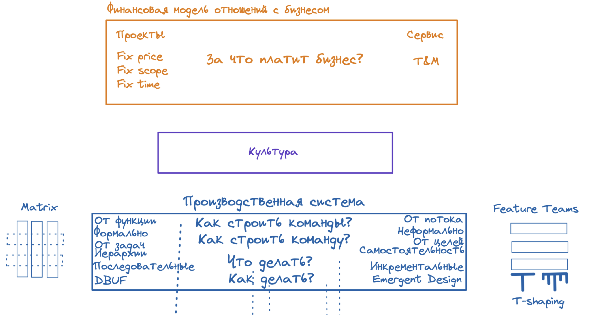
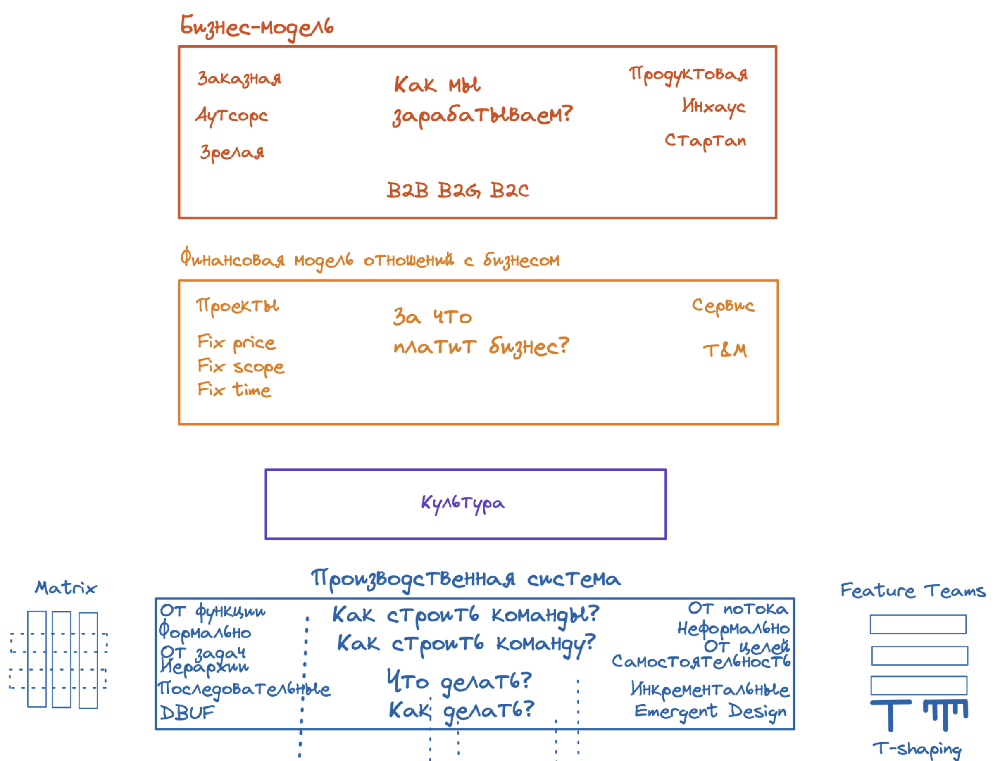

Буржуйское царство
==================
Итак, задавая себе простой вопрос "почему так?" мы добрались до вершины пищевой цепочки.
_Остановись на секунду и скажи_: 
1. _За что_ бизнес платит it? Тебе, в том числе.
1. _Как_ бизнес может платить it? 

Справочник шаблонов финансирования it
-------------------------------------
Типовые решения того, _как_ бизнес платит it, часто называются *способами/моделями бюджетирования* или *финансовой моделью*.

| Финансовые модели                                     | Как работают                                                                                                                                                                                                                                                                                                                                                                                                                                                                                                                                                                                                                                                                                                                                                                                                                                                                                                                                                                                                                                                                                                                                                                                                                                                                                                                                                                                                                                                                                                                                                                                                                              |
|-------------------------------------------------------|-------------------------------------------------------------------------------------------------------------------------------------------------------------------------------------------------------------------------------------------------------------------------------------------------------------------------------------------------------------------------------------------------------------------------------------------------------------------------------------------------------------------------------------------------------------------------------------------------------------------------------------------------------------------------------------------------------------------------------------------------------------------------------------------------------------------------------------------------------------------------------------------------------------------------------------------------------------------------------------------------------------------------------------------------------------------------------------------------------------------------------------------------------------------------------------------------------------------------------------------------------------------------------------------------------------------------------------------------------------------------------------------------------------------------------------------------------------------------------------------------------------------------------------------------------------------------------------------------------------------------------------------|
| Проект VS Сервис                                      | Бизнес может нам платить за успешное завершение **проектов**. Они характеризуются ограниченностью и высокой степенью определнностьи: проект имеет конечный объем (scope), ресурсные затраты и время выполнения. (Что из этого задается жестко и не нами, а что нами – это следующие модели бюджетирования). Получается, что мы как it, должны в условиях зажатости по ресурсам с одной попытки сделать все "правильно": реализовать нужный scope с заданным качеством и не перерасходовав время, бюджет и другие ресурсы. Для этого нам нужно сместить усилия на ранние этапы, очень рано отработать типовые риски: очень четко зафиксировать весь scope (иначе любую вариацию трактовки требований Заказчик будет трактовать в свою пользу – это прямые потери для нас); очень аккуратно провести проектирование (максимально снять возможные риски реализации – минимизировать будущие переделки, так как любой косяк и переделки уже за наш счет). После того, как однозначно поняли, что делать и как делать, дешево и без переделок запилить реализацию и провести тестирование. Общие мысли: e нас одна попытка и любые переделки за наш счет. Но не всегда scope ясен заранее, бизнес не может нам сформулировать до конца, что ему нужно (не по его вине). Тогда лучше работает **сервисная** модель. Ближайшая знакомая аналогия – подписка. То есть бизнес покупает подписку на услуги it по модели "не знаю, что понадобится завтра, поэтому я вам плачу в месяц стоимость подписки и буду отгружать любые хотелки в определенном объеме". Мы будем получать задачи малыми порциями, но очень разнообразные и непредсказуемые. |
| Fix scope, fix time, fix budget VS Time-and-materials | В **fixed**-моделях речь о том, какие параметры финансовых отношений зафиксированы заказчиком, а какие мы оцениваем сами, с нашей стороны. Например, контракт fixed scope: заказчик дает scope, а мы оцениваем с нашей стороны время и стоимость. Самый жесткий вариант, когда контракт фиксирует все три параметра: заказчик со своей стороны озвучивает и scope, и сроки, и бюджет. Тогда с нашей стороны единственная оценка – да/нет, готовы взять/не готовы. **T&M**-модель не заставляет нас предварительно оценивать, а заказчик готов оплачивать столько, сколько мы по факту потратим (времени и расходных материалов).                                                                                                                                                                                                                                                                                                                                                                                                                                                                                                                                                                                                                                                                                                                                                                                                                                                                                                                                                                                                          |

Как эти модели могут сочетаться? 
Жизнь очень разнообразна, поэтому сочетания теоретически могут быть любые. Но есть довольно жесткая корреляция и ты встретишь чаще всего такие пары: "Проект по fixed*" или "Сервис по T&M". 
Плюс учитывай, что мы тут для упрощения рассматриваем крайности, а в реальности может быть смешанная модель: часть работ с одним бюджетированием, часть – с другим. 

И в этом пространстве финансовых моделей, мы как конструктор, собираем свою. Например, у нас может быть _it-сервис_ по _t&m_.

_Зачем это тебе нужно_?
1. Понимание финансовой модели дает тебе понимание, соответствует ли личная и командная культура ожиданиям бизнеса и что следует поменять.
1. Финансовая модель определяют необходимую производственную систему – подходящие процессные практики и оргструктуру. Это касается глубины проработки требований и архитектуры на ранних этапах, практик межкомандного коллективного владения системой, степени свободы инженеров, ограничений на приобретение нужного железа и софта и схемы лицензирования.
1. Финансовая модель определяет scope работ – через нужную частоту релизов и нужное качество обратной связи по метрикам определяются дополнительные внутренние NFR: нужно ли вкладываться в понятность, гибкость, тестопригодность, развертываемость и наблюдемость.
1. Финансовая модель так же влияет и на непосредственно архитектурные решения: сколько ты можешь позволить себе инженерных экспериментов и инноваций. 

И самое главное - если видишь несоответствие между ожиданиями бизнеса и текущей ситуацией, беги обсуждать с менеджментом. Следует строить такую производственную систему, чтобы она поддерживала бизнес, а не мешала ему.

_Что дальше?_
Ок, бизнес по-разному может строить отношения с it. А что нужно самому бизнесу?

Справочник типовых бизнес-моделей
---------------------------------
Итак, мы разобрались, что бизнес ждет от it и за что они ему платит. А как зарабатывает сам бизнес?
Типовые решения того, _что_ из себя представляет бизнес, бизнес-паттерны, называются _типовые бизнес-модели_.  

| Типовые бизнес-модели   | Как работают                                                                                                                                                                                                                                                                                                                                                                                                                                                                                                                                                                                                                                                                                                                                                                                                                                                                                                                                                                                                                                                                                                                                                                                                                                                                                                                                                                                                                                                                                                                                                                                                                                                                                                                                                                                                                                                                                                                                                                                                                                                                                                                                                                                                                                                                                                                                                                                                                                                                                                                                                                                    |
|-------------------------|-------------------------------------------------------------------------------------------------------------------------------------------------------------------------------------------------------------------------------------------------------------------------------------------------------------------------------------------------------------------------------------------------------------------------------------------------------------------------------------------------------------------------------------------------------------------------------------------------------------------------------------------------------------------------------------------------------------------------------------------------------------------------------------------------------------------------------------------------------------------------------------------------------------------------------------------------------------------------------------------------------------------------------------------------------------------------------------------------------------------------------------------------------------------------------------------------------------------------------------------------------------------------------------------------------------------------------------------------------------------------------------------------------------------------------------------------------------------------------------------------------------------------------------------------------------------------------------------------------------------------------------------------------------------------------------------------------------------------------------------------------------------------------------------------------------------------------------------------------------------------------------------------------------------------------------------------------------------------------------------------------------------------------------------------------------------------------------------------------------------------------------------------------------------------------------------------------------------------------------------------------------------------------------------------------------------------------------------------------------------------------------------------------------------------------------------------------------------------------------------------------------------------------------------------------------------------------------------------|
| Заказная VS Продуктовая | Когда компания выполняет **заказы**, это характеризуется наличием _заказчика_. То есть источником требований: есть у кого уточнить требования, мы понимаем, кто и почему будет подписывать приемку наших работ. Неопределенность не такая высокая. И дальше в зависимости от этой самой неопределенности мы ее докомпенсируем финансовой моделью – работаем с ним по проектам или как сервис, по fixed* или t&m. То есть и без того невысокую неопределенность требований можем снизить еще больше. Получается достаточно предсказуемый, но не сильно маржинальный и не сильно масштабируемый бизнес (большой объем заказов нужно обеспечивать большим штатом, громоздкой организационной инфраструктурой и высокой стоимостью конвертации клиента). А вот с **продуктом** все сильно сложнее. Мы создаем некоторое ПО не по заказу конкретного клиента – то есть нашим покупателем является свободный рынок. Мы смутно понимаем конечных пользователей, у нас нет явного заказчика с подписью о приемке работ, нам неоткуда взять детальные требования и уточнять их - все пользователи говорят разное и сами не знают, что хотят[@momtest]. Получается, что неопределенность требований крайне высока – изначально мы понятия не имеем, что именно нужно делать. Поэтому вынуждены компенсировать это дорогостоящими практиками продуктовой разработки – исследованиями пользователей и их потребностей. И с первого раза все равно не получится, поэтому исследование станет непрерывным процессом в основе всего бизнеса. Но даже после того, как получится найти нужный клиентам функционал, его тут же воспроизведут конкуренты. Поэтому нужно бежать в два раза быстрее них, быстрее прорабатывая свои гипотезы. В итоге у такого бизнеса получаются очень высокие риски (за каждым успешным продуктом лежит кладбище продуктов, которые не добежали) и постоянное движение с большими затратами (непрерывный процесс исследований). Зачем тогда основатели идут делать продукты вместо компаний по заказной разработке? А дело в том, что за эти риски полагается очень высокая премия. Если получилось все-таки найти нишу и нащупать нужный функционал, тогда мы начинаем получать колоссальную по меркам заказной разработки прибыль в пересчета на персонал. У нас нет проблем с масштабируемостью: масштабировать производство гораздо тяжелее, чем тиражировать цифровой продукт. То есть впятером с кентами в гараже ты можешь запилить продукт, который будет приносить столько же, сколько и заказная компания со штатом в 5000 человек. Естественно, если доживете до успеха. |
| Аутсорс VS Инхаус       | В случае заказной разработки становится важным, где находится исполнитель – вне бизнес-контура заказчика как отдельная компания, или это часть структуры заказчика. **Внешние аутсорсеры** могут себе позволить свои независимые процессы и культуру. **Внутренние, инхаус** подразделения обладают меньшей свободой в построении культуры и процессов – наследуют от головной компании. Но при этом инхаус-разработчики постоянно в контексте и информационном поле головной компании, у них гораздо меньше организационных барьеров для потоков работ и информации с головной структурой.                                                                                                                                                                                                                                                                                                                                                                                                                                                                                                                                                                                                                                                                                                                                                                                                                                                                                                                                                                                                                                                                                                                                                                                                                                                                                                                                                                                                                                                                                                                                                                                                                                                                                                                                                                                                                                                                                                                                                                                                     |
| Зрелая VS Стартап       | **Стартап – это временная организация**, задача которой – нащупать успешную бизнес-модель. Далее она, как гусеница в бабочку, превращается уже в **зрелую компанию**, задача которой – уже найденную успешную бизнес-модель _масштабировать_ и отбиваться от конкурентов. Поэтому для стартапа важна скорость проработки продуктовых гипотез и легковесность – чтобы этому ничего не мешало. А зрелая компания уже отстраивает тиражируемость, снижает издержки, стандартизует процессы.                                                                                                                                                                                                                                                                                                                                                                                                                                                                                                                                                                                                                                                                                                                                                                                                                                                                                                                                                                                                                                                                                                                                                                                                                                                                                                                                                                                                                                                                                                                                                                                                                                                                                                                                                                                                                                                                                                                                                                                                                                                                                                        |
| B2G VS B2B VS B2C       | Аспект бизнес-модели "кто наш клиент": **G**overnment/госструктуры, **B**usiness/корпоративные клиенты, **C**ustomer/индивидуальные клиенты. Это сильно влияет на неопределенность требований, финансовую цикличность бизнеса, характерные архитектурные риски. В случае B2G характерны долгие релизы с большим scope; достаточно определенные требования, но с большой сложностью предметной области и зависимостями на законодательство; высокие ожидания по внешним NFR; высокими архитектурными рисками с точки зрения интеграции. Для B2B характерны те же черты, но в меньшем объеме, риски обычно меньше; но есть характерная проблема для B2B _продуктового_ бизнеса – попытка запросить фичи, отличающиеся от типовых возможностей твоего продукта. Чтобы отстроиться от конкурентов, некоторые клиенты будут просить садаптировать твой универсальный продукт именно под них. Если на это пойти, то бизнес-модель становится смешанной: продкутово-заказной, и тебе как архитектору сразу же прилетят характерные задачи – поддержка несколькими командами разных версий ПО, управление слияниями изменений, обеспечение вариативности функционала и NFR на уровне архитектуры. И, наконец, B2C – разработка и продажа ПО сразу конечным пользователям: получается, что пользователь и заказчик объединены. Тут тебе нужно хорошо понимать сегмент целевой аудитории, для который вы создаете ПО: это определит нагрузочные характеристики системы; особые значимые требования предъявятся к UI/UX, что повлияет на архитектуру; ограничения по затратам на железо для сходимости unit-экономики.                                                                                                                                                                                                                                                                                                                                                                                                                                                                                                                                                                                                                                                                                                                                                                                                                                                                                                                                                                                     |

И в этом пространстве шаблонов бизнес-решений мы, как конструктор, развиваем свой бизнес. Например, можем оказаться в состоянии _продуктовой_ _зрелой_ компании. 

_Зачем это тебе нужно_?
1. Бизнес-модель определяет все уровни ниже: под бизнес-модель мы строим нужную культуру и производственную систему.
1. Именно в бизнес-модели ты найдешь ответы на все вопросы, на которые не получается ответить на уровнях ниже.
1. Понимание бизнес-модели поможет тебе подготовиться к характерным для нее процессным и архитектурным рискам.

_Что дальше?_
Мы рассмотрели, как принимаются решения на каждом уровне и типовые решения, паттерны для этих уровней. Оглянись назад и представь, как выглядит _вся_ система решений, влияющая на твою архитектурную деятельность?
