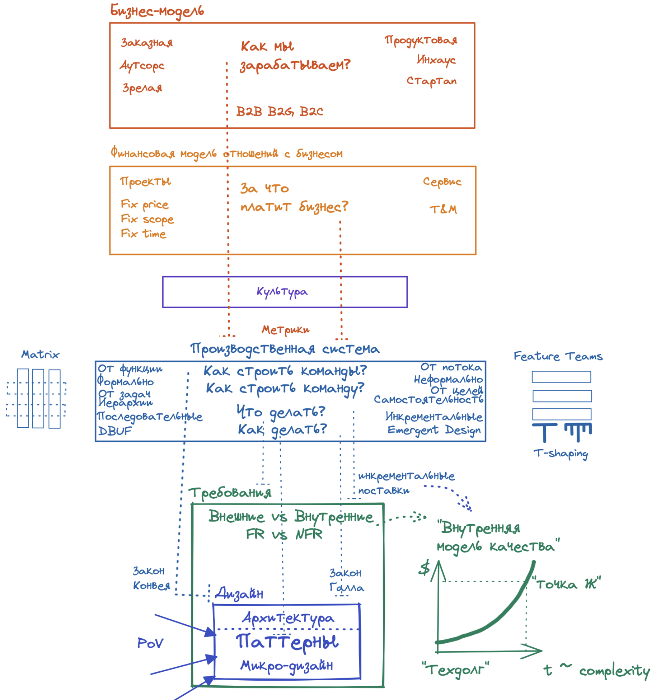

Все вместе
==========
В эффективной бизнес-системе уровни решений согласованы между собой - как в информационной системе модули интегрированы по функционалу и характеристикам.
Давай еще раз посмотрим на уровни решений, которые определят твою архитектуру целевой системы:

_Зачем это тебе нужно_?
Получается, что для успешного выполнения архитектурной функции тебе нужно понимать две вещи:
1. Чем ограничены твои решения (все решения выше архитектуры)
1. Возможные варианты архитектурных решений (архитектурные паттерны, специфические для твоего класса систем)

Да, это две объемные темы. Но теперь ты понимаешь, какая информация тебе нужна и где ее взять. 
Дальше дело за тобой – изучай, спрашивай у коллег, и самое главное – пробуй.   

Добро пожаловать в банду!
