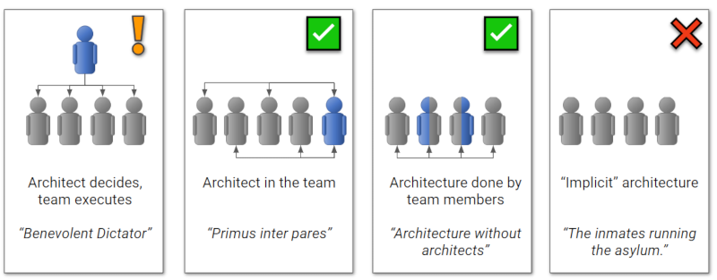

Кто в ответе?
=============
Не всегда архитектор, но функция
--------------------------------
_Остановись на секунду_ и скажи свое мнение – 
какие есть варианты распределения работ конкретного типа по организации? Например, как можно в компании распределить работы по тестированию ПО?

_Давай для примера представим_ 
распределение работ в обычной семье. Часть функций *сконцентрирована на выделенных членах внутри семьи*, например, функция дарения тепла и радости возложена на домашнего питомца. Часть функций *сконцентрирована на выделенных членах вне семьи* – например, функция утреннего выходного выбешивания сконцентрирована на человеке-соседе с перфоратором. А часть функций *размазана* по нескольким участникам внутри и выполняется зачастую *коллективно* – например, выполнение школьных домашек по математике и лепка из желудей. Ну а другая часть функций *размазана* по нескольким участникам и выполняется поочередно.

Точно так же и в корпоративных оргструктурах. Мы попозже обсудим, что такое проектирование и архитектура, но сначала давай обсудим _кто_ может выполнять эту архитектурную работу в компании. Любую работу в оргструктуре можно *сконцентрировать* – возложить на специально ответственного за это человека. Но можно и *«размазать»* – возложить эту работу на группу людей (с чередованием или коллективным вовлечением).

Поэтому корректнее говорить не о конкретном человеке-«архитекторе», а об архитектурной _функции_, – способности и возможности выполнять соответствующую работу. Носителями этой архитектурной функции может быть как и выделенный «архитектор», несколько «архитекторов», так и вся команда как «единый коллективный архитектор».

Так что формально ты можешь не быть архитектором, но при этом участвовать в некоторых обсуждениях, предлагать часть решений, проверять их. То есть *быть носителем архитектурной функции* для своих команд. 

_Что это значит конкретно для тебя?_ 
Ты – носитель архитектурной функции. Чтобы ты эффективнее выполнял эту работу, мы и создали для тебя эти материалы. Они не сделают тебя профессиональным специализированным архитектором. Но дадут достаточное понимание, чтобы ты эффективнее общался с другими носителями архитектурной функции, понимал типовые проблемы и их решения. То есть выступал максимально эффективно при решениях архитектурных вопросов, насколько это возможно для этого сжатого введения. 

_Что дальше?_
Как ты думаешь, а в зависимости от того, как распределяется функция, будет ли меняться качество и скорость работы? Как?

Справочник шаблонов распределения архитектурной функции
-------------------------------------------------------
Один из известных в сообществе архитекторов, Gregor Hohpe, описал[@hohpe2020] варианты того, кто отвечает за архитектурную функцию.  

| Паттерн                           | Описание                                                                                                                                                                                                                                                                                                      |
|-----------------------------------|---------------------------------------------------------------------------------------------------------------------------------------------------------------------------------------------------------------------------------------------------------------------------------------------------------------|
| "Implicit" architecture           | Архитектурная функция отсутствует. То есть никто не занимается этой работой, система получается, как получается и производство несет сумасшедшие риски.                                                                                                                                                       |
| "Benevolent Dictator"             | Архитектурная функция сконцентрирована в одном человеке вне команды. Поток информации и задач односторонний – только от него в сторону команды. Решения принимаются медленно (он неизбежно станет узким местом процесса) и неудачно (его оторванные от реальности решения сложно или невозможно реализовать). |
| "Primus inter pares"              | Архитектурная функция сконцентрирована в одном человеке в рамках команды. Общение с остальной командой двустороннее, решения принимаются быстрее и эффективнее.                                                                                                                                               |
| "Architecture without architects" | Архитектурная функция «размазана» по команде, она вся – коллективный архитектор. Но это не значит, что все постоянно вовлечены в архитектурные задачи. Вовлечение каждого участника происходит по ситуации и по наличию экспертизы для текущей задачи.                                                        |

_Что это значит конкретно для тебя?_
Современный бизнес ждет от нас, it-производства, быстрых и качественных решений, а так же возможности масштабировать производство. Поэтому мы тяготеем в сторону "Architecture without architects". Это значит, что архитектурная функция сегодня требует коммуникативных и soft skills: умения общаться, договариваться, решать структурные конфликты. Поэтому очень важно, чтобы ты хотел и умел работать с людьми. Сегодня для эффективного решения архитектурных задач не достаточно только hard skills.

_Что дальше?_ 
Как ты думаешь, а что такое проектирование и архитектура?

---

Начинаем ботать на фене
=======================
Что такое дизайн и архитектура
------------------------------
_Остановись на секунду_ и скажи свое мнение – 
что такое проектирование? Что такое архитектура?

_Давай для примера представим_, 
что нам нужно запилить табуретку. Как мы можем выстроить работы?

| Паттерн                             | Работы                                                                                                                                                                                                                                                                                                                                                                                                                                                          | Что нам за это будет                                                                                                                                                                                                                           |
|-------------------------------------|-----------------------------------------------------------------------------------------------------------------------------------------------------------------------------------------------------------------------------------------------------------------------------------------------------------------------------------------------------------------------------------------------------------------------------------------------------------------|------------------------------------------------------------------------------------------------------------------------------------------------------------------------------------------------------------------------------------------------|
| "Фигак-фигак и готово"              | Взять те инструменты и материалы, что сейчас есть под рукой, и сразу начать пилить, "по ходу разберемся"                                                                                                                                                                                                                                                                                                                                                        | Если мы не занимаемся столяркой часто, то получим нехватку материалов и нужных инструментов, неверные решения, переделки. В итоге потратим все ресурсы, но пользоваться результатом будет невозможно. В гараж или на балкон на вечные выселки. | 
| "Семь раз отмерь – один раз отрежь" | Сначала в голове или на бумаге моделируем будущий результат (проектирование) и работы (планирование), считаем затраты материалов и времени, ищем моменты, в которых не уверены (риски) и что с этим делать                                                                                                                                                                                                                                                      | Если у нас достаточно опыта и знаний, и поэтому наши представления о будущем результате (проект) и работах (план) не сильно разойдутся с реальностью, то мы получим качественный результат за минимальное время и затраченные ресурсы          |
| "Мамкин исследователь"              | Сначала в голове или на бумаге моделируем будущий результат (проектирование) и работы (планирование), считаем затраты материалов и времени, ищем моменты, в которых не уверены (риски). Все как в прошлом подходе. Но может получиться так, что нашего опыта и знаний не хватает (риски высоки). Тогда нам нужно выделить самые главные решения, от которых зависят остальные (значимые риски) и попробовать подобрать эти решения (исследования, эксперименты) |   

Так вот, в архитектуре ПО все точно так же. Поэтому давай составим русско-архитектурный разговорник:
| Разговор здорового человека | Разговор на фене архитекторов | Пример с табуреткой |
|-----------------------------|-------------------------------|---------------------|
| Процесс представления будущего результата, моделирование в голове или на бумаге | Проектировать, дизайнить | «сколько ножек? материал? форма сидушки? материал? как соединять? покрытие? цвет?» |
| Наше представление результата, модель будущего результата в голове или на бумаге | Проект, дизайн | «три деревянные ножки, круглая деревянная сидушка, клеевые крепления, лаковое покрытие» |
| Самые важные из всех решений. Ключевые решения, несущие в себе главные риски. Решения, которые мы не сможем быстро и дешево отменить. «Нет права на ошибку» | Архитектурно-значимые решения, дизайн архитектуры, архитектура | «везде уверен и знаю как делать, кроме количества ножек и их крепления. сколько – три? четыре? как крепить – клей? саморезы? сварка? клёпка?» |
| Процесс принятия самых ключевых решений, оказывающих влияние на остальные решения и которые трудно отменить | Проектировать архитектуру, дизайнить архитектуру | «три ножки будет достаточно, клеевое крепление выдержит» |

_Что это значит конкретно для тебя?_
В бытовом табуреткостроении зачастую достаточно здравого смысла и инженерной интуиции, впитанной с молоком трудовика в школе. Но если у тебя нет опыта в проектировании it-систем, предстоит путь, в котором мы постараемся тебе максимально эффективно помочь: 
1. Понимать язык архитекторов (справочник ключевых терминов)
1. Понимать готовые типовые архитектурные решения (справочники паттернов) 

_Что дальше?_
Хорошо, когда мы строим идейно-близкую нам систему и все знакомо и понятно – у нас был похожий опыт. Но как ты думаешь, как поступать архитектору, когда у него нет заготовленных знаний по решению нужной задачи?

Справочник подходов к проектированию архитектуры
------------------------------------------------
_Остановись на секунду_ и скажи свое мнение –
что делать в ситуации, когда прошлого опыта не хватает для решения задачи?

_Давай для примера представим_,
что нам нужно запилить табуретку. Но приблизим условия к более реальным. Инструменты по дереву ты видел последний раз в школе, а современные инструменты и материалы не видел даже на картинках. А табурет не ждет! Как стоит построить работу?

| Ситуация с задачей                                                           | Что подсказывает здравый смысл                                                                                                                                                                                                                                    | Паттерн на фене                                                                                     |
|------------------------------------------------------------------------------|-------------------------------------------------------------------------------------------------------------------------------------------------------------------------------------------------------------------------------------------------------------------|-----------------------------------------------------------------------------------------------------|
| Решаем такие задачи каждый день: однообразные задачи, повторяющие предыдущие | Делать как обычно (по готовому дизайну/архитектуре) – правильные решения уже приянты. Надо просто не накосячить в исполнении («работает – не трогай!»). _«У нас уже есть какая-то тактика и мы ее придерживаемся»_                                                | Существует явная *Default Architecture*, которой жестко следуем                                     | 
| Задачи имеют разнообразие, но сводятся к набору предыдущих                   | Провести глубокое проектирование: принять все решения заранее – от самых главных до мельчайших. На каждом шаге стараться решения сводить к проверенным (паттернам). _«Семь раз все отмерь – один раз потом отрежь»_                                               | Проектируем заранее по *BDUF*: Big Design Up Front                                                  |                                                                                                                   
| Задачи имеют разнообразие, но сводятся к набору предыдущих                   | Провести проектирование только архитектуры: принять только ключевые решения. Менее значимые решения по дизайну или отложить, или отдать конкретному исполнителю этого элемента системы. _«С фигней кто-нибудь разберется потом»_                                  | Проектируем по модели *Lean Software Development*: Up Front Architecture + Emergent micro-design    |                                                                                                                   
| Задачи имеют крайнее разнообразие, не сводятся к предыдущим – новые для нас  | Пытаться заранее запроектировать все не получится – наш опыт не может подсказать, где риски. Заранее знаний нет, поэтому будем их получать в процессе – ставить инженерные эксперименты и успешные результаты включать в архитектурные решения. _«Разведка боем»_ | Emergent Architecture, Agile Architecture, Инженерные гипотезы архитектуры, Архитектурные прототипы |     

_Что это значит конкретно для тебя?_
Необходимо знать не только готовые архитектурные решения (паттерны), но и помогать команде проектировать в условиях новых незнакомых задач: 
1. Понимать ключевые принципы построения it-систем (справочник принципов) – универсальных архитектурных ограничений, независимо от новизны задачи
1. В случае, когда текущей экспертизы команды не хватает, участвовать в проверке инженерных гипотез (архитектурных прототипов)

_Что дальше?_
У нас вырисовывается необходимый набор знаний и умений носителя архитектурной функции.
Но как ты думаешь, всем ли архитекторам это надо в одинаковом объеме? Нет ли разделения архитекторов с разными ожиданиями по знаниям и навыкам? Какие это могут быть критерии? 

Справочник масштабов архитектурных решений
------------------------------------------
_Остановись на секунду_ и скажи свое мнение –
Можно ли разделить архитекторов по масштабу систем? Одинаковые ли требования к знаниям и навыкам будут для них?

По масштабу систем индустрия выделяет несколько уровней, ниже самая популярная модель (но далеко не единственная).
_Давай для примера_ проведем аналогии со строительными архитекторами:

| Объекты проектирования | Роль в строительном мире                               | Роль в it-мире       | Объекты проектирования                                                                                                                                                            |
|------------------------|--------------------------------------------------------|----------------------|-----------------------------------------------------------------------------------------------------------------------------------------------------------------------------------|
| Квартира/Помещение     | Дизайнер/Проектировщик                                 | System Architect     | Системы: сравнительно небольшие, с явными границами, целостно реализованные внутри.                                                                                               |
| Здание                 | Архитектор типового или индивидуального проекта здания | Solution Architect   | Решения: целые группы систем, интегрированные между собой, реализованные по разным правилам. Но вместе они образуют решение – то есть закрывают потребности одной бизнес-функции. |   
| Город                  | Главный архитектор города или региона                  | Enterprise Architect | Весь корпоративный it-ландшафт: все системы, образующие все решения плюс инфраструктурные системы, не входящие в решения.                                                         |

_Что это значит конкретно для тебя?_
Мы готовим тебя к функции в первую очередь *системной* архитектуры. Но системы не существуют в отрыве от решений и всего it-ландшафта. И тебе обязательно предстоит столкнуться так же с вопросами solution и enterprise архитектур. 
Поэтому для своей системы всегда надо знать:
1. Человека или команду, реализующих функцию solution architect
1. Человека или команду, реализующих функцию enterprise architect
1. Корпоративные архитектурные правила и ограничения (от enterprise architect)
1. Архитектурные правила и ограничения решения (от solution architect)
1. С какими системами нужно интегрироваться (от solution architect)
1. Как согласовывать решения по своей системе с solution и enterprise architect

_Что дальше?_
Мы сформулировали проектирование архитектуры как принятие самых важных, сложных и дорогих решений.
А как ты думаешь, конкретно что это за решения? На примерах.
Когда тебе говорят слово "архитектура" – первый визуальный образ, который приходит? 

---

Песенка о проекциях, слонах и гиперкубах
========================================
- PoV: как смотреть на систему 
- Почему одна из PoV так важна?
- Справочник ключевых PoV (+принципы развития, договорились впредь делать вот так)
- Выбор PoV для принятия решений

А судьи кто?
============
- PoV и стейкхолдеры
- Справочник стейкхолдеров
- Архитектурная функция как интеграция точек зрения всех стейкхолдеров

Обоснуй меня полностью
======================
- Таксономия требований к целевой системе
- Функциональные требования
- Атрибуты качества
- Модель внутреннего качества
- Архитектурные ограничения от корп ландшафта
- Trade-offs (дилеммы)
- Справочник частых дилемм в дизайне
- Справочник принципов разрешения дилемм

Иди туда, не знаю куда
======================
- Проблема внутренней неопределенности (решения)
- Справочник принципов разрешения внутренней неопределенности (решения)
- Практика Design Doc

Топчик частых решений в дизайне
===============================
- Принципы проектирования в формате "Задача - Дилеммы - Принципы"
- Справочник принципов функциональной декомпозиции
- Справочник принципов логической декомпозиции (+ expression problem)
- Справочник принципов проектирования взаимодействий
- Справочник принципов физической декомпозиции

Топчик частых шаблонов проектирования
=====================================
- Шаблоны проектирования в формате "Задача - Дилеммы - Шаблоны"
- [GoF] (core)
- [PoEAA] (core)
- [DDD] (mdd, ubiquitous language, bounded contexts -> microservices)
- [Integration Patterns] (ссылка на существующий cookbook)
- [Microservices Patterns] (ссылка на существующий cookbook)

Принеси то, не знаю что
=======================
- Проблема внешней неопределенности (требований)
- На каком уровне решаем эту проблему: процесс
- Справочник принципов разрешения внешней неопределенности (требований)
- Практика Time boxing
- Практики Lean SWD
- Практика инкрементальных поставок

Производство системы производства
=================================
- Как производственная система влияет на дизайн
- Практика T-shaping
- Справочник шаблонов коллективного владения системой

Буржуйское царство
==================
- Как финансовая модель влияет на дизайн
- Справочник шаблонов финансирования it
- Как бизнес-модель влияет на дизайн
- Справочник шаблонов бизнес-моделей
